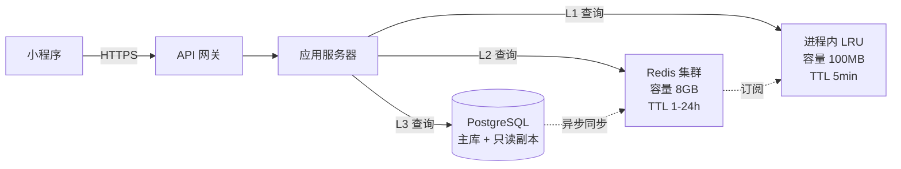
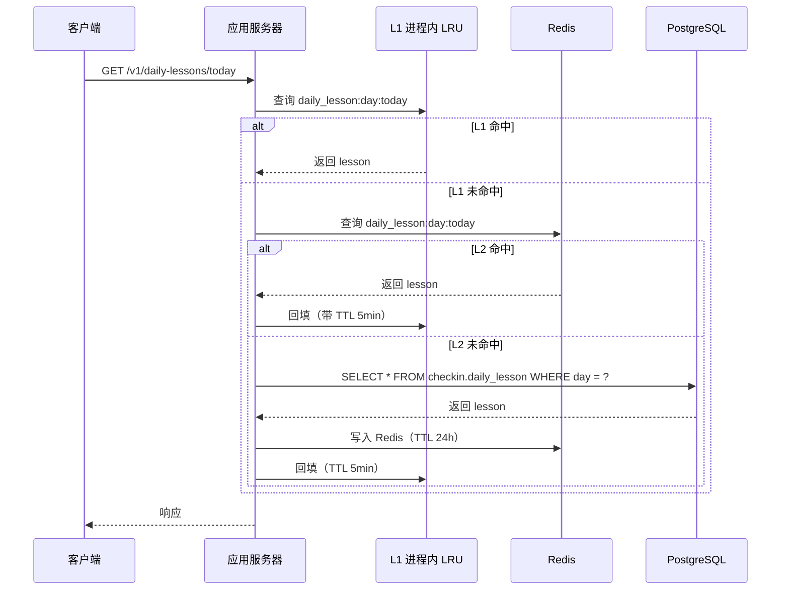
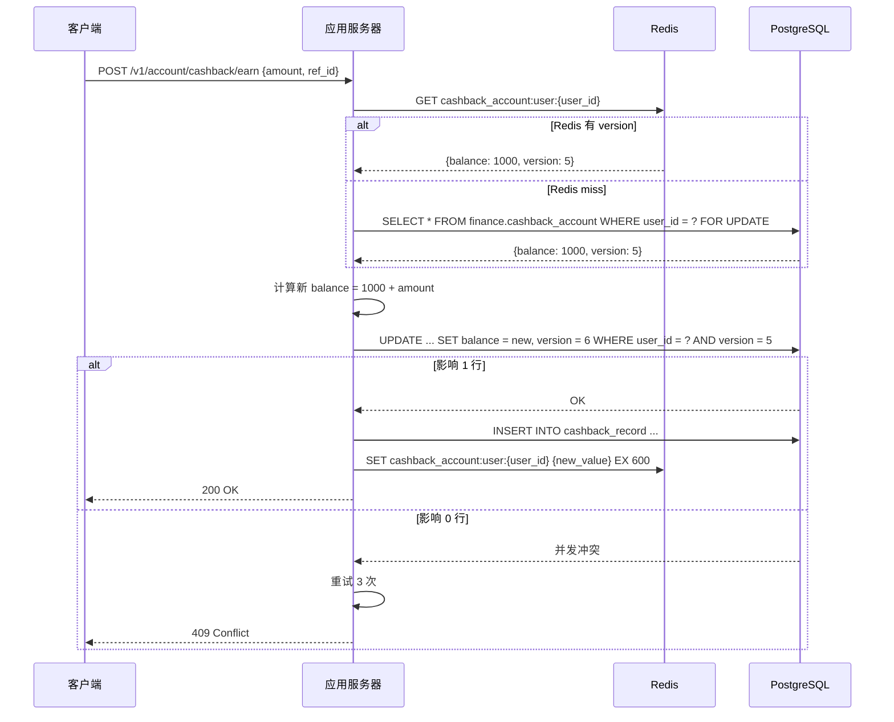
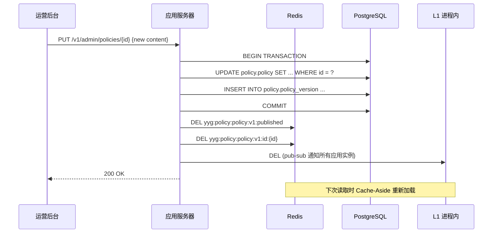
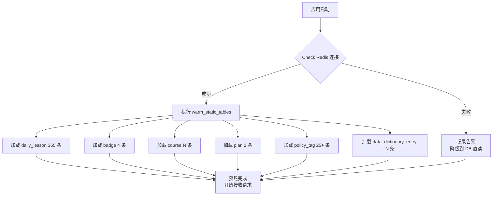

# 宝妈英语早操小程序 · PostgreSQL 数据库设计文档

> **项目代号**：mom-english-taro
> **数据库**：PostgreSQL 14+
> **ORM**：Django ORM + Django Migrations
> **字符集**：UTF-8
> **排序规则**：`en_US.UTF-8`（开发环境）/ `zh_CN.UTF-8`（生产环境按需）
> **时区**：所有时间戳存 UTC（`TIMESTAMPTZ`），业务侧以东八区解析
> **主键约定**：所有表主键统一 `BIGSERIAL`（业务侧用 `VARCHAR(32)` 字符串 ID 时另设 `business_id` 字段）
> **版本**：v1.2
> **最后更新**：2026-06-17

---

## ⚠️ 本期暂不实现的模块（重要）

> 为聚焦 MVP 核心功能，**以下表与字段本期不在数据库中创建（不写 Django migration）**。文档保留仅为后续版本做规划。

| 暂不创建的表 | 涉及字段 | 暂不实现原因 |
| --- | --- | --- |
| ⛔ `payment_order` 支付订单表 | 整表不创建 | 暂不接入微信支付 |
| ⛔ `payment_refund` 退款表 | 整表不创建 | 同上 |
| ⛔ `withdraw_order` 提现订单表 | 整表不创建 | 暂不开放用户提现 |
| `cashback_account` 中 `frozen_cents`、`total_withdrawn_cents` 字段 | 字段保留默认值 0 | 提现未开放，无需冻结/累计逻辑 |
| `cashback_record` 中 `type='withdraw'`、`type='refund'` 流水 | 业务触发器本期不写 | 同上 |
| `user_plan.payment_order_id` 字段 | 字段保留为 NULL，允许为空 | 暂无支付订单可关联 |

### 本期 MVP 替代方案

| 表/字段 | 本期行为 | 不创建的影响 |
| --- | --- | --- |
| `plan` 计划表 | **保留创建**，`trial21`、`year365` 两条 SKU 仍写入 | 21 天 trial 计划走邀请逻辑（`invite_3` trigger）；365 天计划**不开放前端入口**，仅运营后台手工调 `/admin/users/{id}/adjust-plan` 开通 |
| `user_plan` | 仍记录 `status=year365` 的记录（运营手工开通场景） | 唯一区别是 `payment_order_id` 永远 NULL |
| `cashback_account` | 仍记录 `balance_cents`、`total_earned_cents`、`expected_cashback_cents` | 返现可累计可展示，但**不开放提现接口** |
| `cashback_record` | 仅写入 `type='earn'`、`type='manual_adjust'` 流水 | 不出现 `withdraw` / `refund` 类型 |

> **相关表在文档中以** ⛔ **图标标注**，请勿在 v1 阶段执行对应 migration。

---

## 目录

- [1. 设计原则与约定](#1-设计原则与约定)
- [2. 总体 ER 图（模块视角）](#2-总体-er-图模块视角)
- [3. Schema 划分](#3-schema-划分)
- [4. 基础数据表（基础层）](#4-基础数据表基础层)
  - [4.1 `user` 用户表](#41-user-用户表)
  - [4.2 `user_auth` 用户认证表](#42-user_auth-用户认证表)
  - [4.3 `user_profile` 用户资料扩展表](#43-user_profile-用户资料扩展表)
  - [4.4 `push_token` 推送 token 表](#44-push_token-推送-token-表)
- [5. 打卡与课程（核心域）](#5-打卡与课程核心域)
  - [5.1 `daily_lesson` 每日课程表](#51-daily_lesson-每日课程表)
  - [5.2 `checkin` 打卡主表](#52-checkin-打卡主表)
  - [5.3 `sub_task` 子任务表](#53-sub_task-子任务表)
  - [5.4 `checkin_sub_task` 打卡-子任务关联表](#54-checkin_sub_task-打卡-子任务关联表)
  - [5.5 `audio_play_log` 音频播放日志表](#55-audio_play_log-音频播放日志表)
  - [5.6 `reflection_question` 反思问题库表](#56-reflection_question-反思问题库表)
- [6. 返现账户与计划（商业化层）](#6-返现账户与计划商业化层)
  - [6.1 `plan` 计划表](#61-plan-计划表)
  - [6.2 `user_plan` 用户计划表](#62-user_plan-用户计划表)
  - [6.3 `cashback_account` 返现账户表](#63-cashback_account-返现账户表)
  - [6.4 `cashback_record` 返现流水表](#64-cashback_record-返现流水表)
  - [6.5 `withdraw_order` 提现订单表](#65-withdraw_order-提现订单表)
  - [6.6 `payment_order` 支付订单表](#66-payment_order-支付订单表)
  - [6.7 `payment_refund` 退款表](#67-payment_refund-退款表)
- [7. 徽章系统](#7-徽章系统)
  - [7.1 `badge` 徽章定义表](#71-badge-徽章定义表)
  - [7.2 `user_badge` 用户徽章表](#72-user_badge-用户徽章表)
- [8. 课程与权益](#8-课程与权益)
  - [8.1 `course` 课程表](#81-course-课程表)
  - [8.2 `course_exchange` 课程兑换表](#82-course_exchange-课程兑换表)
  - [8.3 `course_inquiry` 课程咨询线索表](#83-course_inquiry-课程咨询线索表)
- [9. 姐妹同行（社交层）](#9-姐妹同行社交层)
  - [9.1 `sister_team` 姐妹小队表](#91-sister_team-姐妹小队表)
  - [9.2 `sister_team_member` 小队成员表](#92-sister_team_member-小队成员表)
  - [9.3 `sister_team_activity` 小队动态表](#93-sister_team_activity-小队动态表)
  - [9.4 `sister_team_interaction` 互动记录表](#94-sister_team_interaction-互动记录表)
  - [9.5 `sister_team_encouragement` 鼓励留言表](#95-sister_team_encouragement-鼓励留言表)
  - [9.6 `sister_team_remind_log` 提醒日志表](#96-sister_team_remind_log-提醒日志表)
- [10. 蜕变广场与同频交友](#10-蜕变广场与同频交友)
  - [10.1 `square_post` 蜕变动态表](#101-square_post-蜕变动态表)
  - [10.2 `square_post_image` 动态图片表](#102-square_post_image-动态图片表)
  - [10.3 `square_post_like` 动态点赞表](#103-square_post_like-动态点赞表)
  - [10.4 `square_post_comment` 动态评论表](#104-square_post_comment-动态评论表)
  - [10.5 `love_profile` 同频交友资料表](#105-love_profile-同频交友资料表)
  - [10.6 `love_follow` 关注关系表](#106-love_follow-关注关系表)
- [11. 妈妈成长计划](#11-妈妈成长计划)
  - [11.1 `milestone_definition` 蜕变节点定义表](#111-milestone_definition-蜕变节点定义表)
  - [11.2 `user_milestone` 用户蜕变节点记录表](#112-user_milestone-用户蜕变节点记录表)
  - [11.3 `offline_activity` 同城活动表](#113-offline_activity-同城活动表)
  - [11.4 `offline_activity_signup` 活动报名表](#114-offline_activity_signup-活动报名表)
- [12. 孩子成长评估](#12-孩子成长评估)
  - [12.1 `kid_assessment_template` 评估问题模板表](#121-kid_assessment_template-评估问题模板表)
  - [12.2 `kid_assessment_question` 评估问题表](#122-kid_assessment_question-评估问题表)
  - [12.3 `kid_assessment_submission` 评估提交记录表](#123-kid_assessment_submission-评估提交记录表)
  - [12.4 `kid_assessment_answer` 评估答案表](#124-kid_assessment_answer-评估答案表)
  - [12.5 `kid_assessment_score_item` 评分项表](#125-kid_assessment_score_item-评分表)
  - [12.6 `kid_child_profile` 孩子画像表（V8 测评）](#126-kid_child_profile-孩子画像表v8-测评)
- [13. 政策内容 CMS](#13-政策内容-cms)
  - [13.1 `policy` 政策主表](#131-policy-政策主表)
  - [13.2 `policy_version` 政策版本表](#132-policy_version-政策版本表)
  - [13.3 `policy_review` 政策审核表](#133-policy_review-政策审核表)
  - [13.4 `policy_tag` 政策标签表](#134-policy_tag-政策标签表)
  - [13.5 `policy_tag_relation` 政策-标签关联表](#135-policy_tag_relation-政策-标签关联表)
  - [13.6 `policy_task` 政策子任务表](#136-policy_task-政策子任务表)
  - [13.7 `policy_weekly_task` 政策周建议表](#137-policy_weekly_task-政策周建议表)
  - [13.8 `policy_ai_generation_log` AI 生成日志表](#138-policy_ai_generation_log-ai-生成日志表)
- [14. 邀请与拉新](#14-邀请与拉新)
  - [14.1 `invite_code` 邀请码表](#141-invite_code-邀请码表)
  - [14.2 `invite_record` 邀请记录表](#142-invite_record-邀请记录表)
- [15. 消息通知](#15-消息通知)
  - [15.1 `message` 消息表](#151-message-消息表)
  - [15.2 `message_receipt` 消息回执表](#152-message_receipt-消息回执表)
- [16. 文件与海报](#16-文件与海报)
  - [16.1 `uploaded_file` 上传文件表](#161-uploaded_file-上传文件表)
  - [16.2 `poster` 海报表](#162-poster-海报表)
- [17. 运营后台与审计](#17-运营后台与审计)
  - [17.1 `admin_user` 后台账号表](#171-admin_user-后台账号表)
  - [17.2 `admin_role` 角色表](#172-admin_role-角色表)
  - [17.3 `admin_permission` 权限表](#173-admin_permission-权限表)
  - [17.4 `admin_role_permission` 角色-权限表](#174-admin_role_permission-角色-权限表)
  - [17.5 `admin_audit_log` 审计日志表](#175-admin_audit_log-审计日志表)
  - [17.6 `data_dictionary_entry` 通用字典表](#176-data_dictionary_entry-通用字典表)
- [18. 索引总览](#18-索引总览)
- [19. 业务规则摘要](#19-业务规则摘要)
- [20. 数据库变更管理](#20-数据库变更管理)
- [附录 A：完整数据字典（业务对象 → 表 反向索引）](#附录-a完整数据字典业务对象--表-反向索引)
- [附录 B：PostgreSQL ENUM 类型定义（建议）](#附录-bpostgresql-enum-类型定义建议)
- [附录 C：未来扩展预留](#附录-c未来扩展预留)
- [附录 D：数据迁移指南（前端 mock / localStorage → 数据库）](#附录-d数据迁移指南前端-mock--localstorage--数据库)

---

## 1. 设计原则与约定

1. **三范式 + 适度反范式**：在 OLTP 场景遵循 3NF，对于统计型字段（如 `checked_days`、`consecutive_days`）允许在用户表冗余，提升查询性能。
2. **统一时间**：所有 `*_at` 字段使用 `TIMESTAMPTZ`，应用层使用 `Asia/Shanghai`。
3. **软删除**：除日志、流水等数据外，所有业务表保留 `deleted_at`，由应用层处理删除逻辑，便于审计。
4. **审计字段**：所有表包含 `created_at` / `updated_at` / `created_by` / `updated_by`。
5. **金额单位**：统一用 `BIGINT`（分）存储，绝不使用浮点。
6. **枚举管理**：可枚举字段使用 PostgreSQL `ENUM TYPE`，少量灵活字段使用 `VARCHAR(64)` + 应用层校验。
7. **命名规范**：
   - 表名：`snake_case`，单数（与 Django 默认一致），如 `user`、`checkin`。
   - 主键：`id`（`BIGSERIAL`）。
   - 外键：`<参照表>_id`。
   - 索引：`idx_<表>_<字段>`，唯一索引：`uniq_<表>_<字段>`。
8. **分库分表预留**：用户/打卡/订单/流水数据按 `user_id` 做 hash 分片；`checkin` 与 `cashback_record` 按月分区。
9. **字符集**：所有表使用 `utf8mb4`（PostgreSQL 即 `UTF8`）支持 emoji。
10. **PostgreSQL 特性**：
    - 使用 `JSONB` 存储可变结构（如 policy 生成任务的扩展配置）。
    - 使用 `tsvector` + GIN 索引做全文检索（政策标题/正文）。
    - 使用 `pgcrypto` 加密敏感字段（如 `phone_encrypted`）。

---

## 2. 总体 ER 图（模块视角）

```mermaid
erDiagram
    USER ||--o| USER_AUTH : "1:1"
    USER ||--o| USER_PROFILE : "1:1"
    USER ||--o{ USER_PLAN : "1:N"
    USER ||--o| CASHBACK_ACCOUNT : "1:1"
    USER ||--o{ CHECKIN : "1:N"
    USER ||--o{ USER_BADGE : "1:N"
    USER ||--o| SISTER_TEAM_MEMBER : "1:N"
    USER ||--o{ SQUARE_POST : "1:N"
    USER ||--o{ KID_ASSESSMENT_SUBMISSION : "1:N"
    USER ||--o{ PAYMENT_ORDER : "1:N"
    USER ||--o{ WITHDRAW_ORDER : "1:N"
    USER ||--o{ MESSAGE : "1:N"

    SISTER_TEAM ||--o{ SISTER_TEAM_MEMBER : "1:N"
    SISTER_TEAM ||--o{ SISTER_TEAM_ACTIVITY : "1:N"
    SISTER_TEAM_MEMBER ||--o{ SISTER_TEAM_ACTIVITY : "1:N"
    SISTER_TEAM_ACTIVITY ||--o{ SISTER_TEAM_INTERACTION : "1:N"
    SISTER_TEAM_ACTIVITY ||--o{ SISTER_TEAM_ENCOURAGEMENT : "1:N"

    POLICY ||--o{ POLICY_VERSION : "1:N"
    POLICY ||--o{ POLICY_REVIEW : "1:N"
    POLICY ||--o{ POLICY_TAG_RELATION : "1:N"
    POLICY_TAG ||--o{ POLICY_TAG_RELATION : "1:N"
    POLICY ||--o{ POLICY_TASK : "1:N"
    POLICY ||--o{ POLICY_WEEKLY_TASK : "1:N"

    CHECKIN ||--o{ CHECKIN_SUB_TASK : "1:N"
    SUB_TASK ||--o{ CHECKIN_SUB_TASK : "1:N"

    PLAN ||--o{ USER_PLAN : "1:N"

    COURSE ||--o{ COURSE_EXCHANGE : "1:N"

    KID_ASSESSMENT_TEMPLATE ||--o{ KID_ASSESSMENT_QUESTION : "1:N"
    KID_ASSESSMENT_TEMPLATE ||--o{ KID_ASSESSMENT_SUBMISSION : "1:N"
    KID_ASSESSMENT_SUBMISSION ||--o{ KID_ASSESSMENT_ANSWER : "1:N"
    KID_ASSESSMENT_SUBMISSION ||--o{ KID_ASSESSMENT_SCORE_ITEM : "1:N"

    MILESTONE_DEFINITION ||--o{ USER_MILESTONE : "1:N"
```



> 完整 SQL DDL 见同目录 `sql/ddl.sql`（**待提交到仓库后生成**）。

---

## 3. Schema 划分

> PostgreSQL 不强制使用多 schema，但按业务域拆分可降低耦合、提升维护性。

| Schema | 说明 | 主要表 |
| --- | --- | --- |
| `core` | 核心基础 | `user`、`user_auth`、`user_profile`、`push_token` |
| `checkin` | 打卡与课程 | `daily_lesson`、`checkin`、`sub_task`、`checkin_sub_task`、`audio_play_log`、`reflection_question` |
| `finance` | 商业化（账户/支付/返现） | `plan`、`user_plan`、`cashback_account`、`cashback_record`、`withdraw_order`、`payment_order`、`payment_refund` |
| `social` | 社交 | `sister_team`、`sister_team_member`、`sister_team_activity`、`sister_team_interaction`、`sister_team_encouragement`、`sister_team_remind_log`、`square_post`、`square_post_image`、`square_post_like`、`square_post_comment`、`love_profile`、`love_follow` |
| `mom_growth` | 妈妈成长 | `milestone_definition`、`user_milestone`、`offline_activity`、`offline_activity_signup` |
| `kid_assessment` | 孩子评估 | `kid_assessment_template`、`kid_assessment_question`、`kid_assessment_submission`、`kid_assessment_answer`、`kid_assessment_score_item` |
| `policy` | 政策 CMS | `policy`、`policy_version`、`policy_review`、`policy_tag`、`policy_tag_relation`、`policy_task`、`policy_weekly_task`、`policy_ai_generation_log` |
| `incentive` | 激励 | `badge`、`user_badge`、`course`、`course_exchange` |
| `invite` | 邀请 | `invite_code`、`invite_record` |
| `message` | 消息 | `message`、`message_receipt` |
| `media` | 文件 | `uploaded_file`、`poster` |
| `admin` | 后台 | `admin_user`、`admin_role`、`admin_permission`、`admin_role_permission`、`admin_audit_log` |
| `dict` | 字典 | `data_dictionary_entry` |

---

## 4. 基础数据表（基础层）

### 4.1 `user` 用户表

> 存储用户核心身份信息。

| 字段 | 数据类型 | 约束 | 默认 | 描述 |
| --- | --- | --- | --- | --- |
| `id` | `BIGSERIAL` | PK | auto | 主键 |
| `business_id` | `VARCHAR(32)` | UNIQUE, NOT NULL | - | 业务主键，前缀 `usr_` |
| `openid` | `VARCHAR(64)` | UNIQUE, NOT NULL | - | 微信 openid |
| `unionid` | `VARCHAR(64)` | UNIQUE, NULL | - | 微信 unionid（多端打通） |
| `nickname` | `VARCHAR(64)` | NOT NULL | - | 昵称 |
| `avatar_url` | `VARCHAR(512)` | NULL | - | 头像 |
| `phone` | `VARCHAR(128)` | NULL | - | 手机号 AES 加密存储 |
| `phone_masked` | `VARCHAR(20)` | NULL | - | 脱敏展示，如 `138****1234` |
| `gender` | `SMALLINT` | NULL | 0 | 0 未知/1 男/2 女 |
| `role` | `VARCHAR(32)` | NOT NULL | `'user'` | `user` / `admin` / `editor` / `reviewer` |
| `is_admin` | `BOOLEAN` | NOT NULL | FALSE | 是否后台账号 |
| `is_disabled` | `BOOLEAN` | NOT NULL | FALSE | 是否被封禁 |
| `disabled_reason` | `VARCHAR(256)` | NULL | - | 封禁原因 |
| `disabled_at` | `TIMESTAMPTZ` | NULL | - | 封禁时间 |
| `last_login_at` | `TIMESTAMPTZ` | NULL | - | 最近登录 |
| `created_at` | `TIMESTAMPTZ` | NOT NULL | `NOW()` | 创建时间 |
| `updated_at` | `TIMESTAMPTZ` | NOT NULL | `NOW()` | 更新时间 |
| `deleted_at` | `TIMESTAMPTZ` | NULL | - | 软删除 |

**索引**：

```sql
CREATE UNIQUE INDEX uniq_user_business_id ON core.user (business_id);
CREATE UNIQUE INDEX uniq_user_openid ON core.user (openid);
CREATE INDEX idx_user_unionid ON core.user (unionid) WHERE unionid IS NOT NULL;
CREATE INDEX idx_user_created_at ON core.user (created_at DESC);
```

---

### 4.2 `user_auth` 用户认证表

> 登录凭证、refresh token 等。

| 字段 | 数据类型 | 约束 | 默认 | 描述 |
| --- | --- | --- | --- | --- |
| `id` | `BIGSERIAL` | PK | | |
| `user_id` | `BIGINT` | FK→`user.id`, NOT NULL, UNIQUE | | 一对一 |
| `password_hash` | `VARCHAR(255)` | NULL | | 第三方登录用户密码（通常 NULL） |
| `refresh_token_hash` | `VARCHAR(255)` | NULL | | refresh token 哈希 |
| `refresh_token_expires_at` | `TIMESTAMPTZ` | NULL | | 过期时间 |
| `totp_secret` | `VARCHAR(64)` | NULL | | 后台账号 TOTP 密钥（加密） |
| `last_login_ip` | `INET` | NULL | | 登录 IP |
| `last_login_user_agent` | `VARCHAR(512)` | NULL | | 客户端 UA |
| `failed_login_count` | `INT` | NOT NULL | 0 | 连续失败次数 |
| `locked_until` | `TIMESTAMPTZ` | NULL | | 锁定截止时间 |
| `created_at` | `TIMESTAMPTZ` | NOT NULL | `NOW()` | |
| `updated_at` | `TIMESTAMPTZ` | NOT NULL | `NOW()` | |

**索引**：

```sql
CREATE UNIQUE INDEX uniq_user_auth_user_id ON core.user_auth (user_id);
```

---

### 4.3 `user_profile` 用户资料扩展表

> 业务侧画像信息，与 `user` 拆表避免热点行。

| 字段 | 数据类型 | 约束 | 默认 | 描述 |
| --- | --- | --- | --- | --- |
| `id` | `BIGSERIAL` | PK | | |
| `user_id` | `BIGINT` | FK→`user.id`, NOT NULL, UNIQUE | | |
| `baby_stage` | `VARCHAR(32)` | NULL | | `kindergarten` / `lower` / `upper` / `junior` |
| `region` | `VARCHAR(64)` | NULL | | 所在地区标签 |
| `city` | `VARCHAR(64)` | NULL | | 同城活动用 |
| `bio` | `VARCHAR(500)` | NULL | | 个人简介 |
| `tags` | `JSONB` | NOT NULL | `'[]'::jsonb` | 用户标签 |
| `plan_status` | `VARCHAR(16)` | NOT NULL | `'none'` | **本期完整枚举**：`none` / `trial7` / `trial21` / `21d_plan` / `100d_plan` / `year365`（与 API.md §4.5 / 附录 B ENUM 一致） |
| `plan_started_at` | `TIMESTAMPTZ` | NULL | | 当前计划开始时间 |
| `plan_expires_at` | `TIMESTAMPTZ` | NULL | | 当前计划到期时间 |
| `trial21_unlocked` | `BOOLEAN` | NOT NULL | FALSE | 21 天体验是否解锁 |
| `invite_progress` | `INT` | NOT NULL | 0 | 有效邀请达成 0-3 |
| `checked_days` | `INT` | NOT NULL | 0 | 累计打卡 |
| `missed_days` | `INT` | NOT NULL | 0 | 累计漏打卡 |
| `consecutive_days` | `INT` | NOT NULL | 0 | 连续打卡 |
| `longest_streak` | `INT` | NOT NULL | 0 | 历史最长连续 |
| `course_unlocked` | `INT` | NOT NULL | 0 | 已解锁课程数 |
| `course_total` | `INT` | NOT NULL | 0 | 总课程数 |
| `extra` | `JSONB` | NOT NULL | `'{}'::jsonb` | 扩展字段 |
| `updated_at` | `TIMESTAMPTZ` | NOT NULL | `NOW()` | |

**索引**：

```sql
CREATE UNIQUE INDEX uniq_user_profile_user_id ON core.user_profile (user_id);
CREATE INDEX idx_user_profile_plan_status ON core.user_profile (plan_status);
CREATE INDEX idx_user_profile_region_city ON core.user_profile (region, city);
```

---

### 4.4 `push_token` 推送 token 表

| 字段 | 数据类型 | 约束 | 描述 |
| --- | --- | --- | --- |
| `id` | `BIGSERIAL` | PK | |
| `user_id` | `BIGINT` | FK→`user.id`, NOT NULL | |
| `provider` | `VARCHAR(32)` | NOT NULL | `wechat_mp` / `wechat_subscribe` |
| `token` | `VARCHAR(255)` | NOT NULL | |
| `device_id` | `VARCHAR(128)` | NULL | |
| `is_active` | `BOOLEAN` | NOT NULL, DEFAULT TRUE | |
| `last_active_at` | `TIMESTAMPTZ` | NOT NULL, DEFAULT NOW() | |
| `created_at` | `TIMESTAMPTZ` | NOT NULL, DEFAULT NOW() | |

**索引**：

```sql
CREATE INDEX idx_push_token_user_provider ON core.push_token (user_id, provider) WHERE is_active = TRUE;
CREATE UNIQUE INDEX uniq_push_token_token ON core.push_token (provider, token);
```

---

## 5. 打卡与课程（核心域）

### 5.1 `daily_lesson` 每日课程表

> 一年 365 天的英语早操素材。

| 字段 | 数据类型 | 约束 | 默认 | 描述 |
| --- | --- | --- | --- | --- |
| `id` | `BIGSERIAL` | PK | | |
| `day` | `INT` | UNIQUE, NOT NULL | | 第 N 天，1-365 |
| `theme` | `VARCHAR(255)` | NOT NULL | | 主题，如 `Day 1 英语早操` |
| `task` | `VARCHAR(500)` | NOT NULL | | 当日任务简述 |
| `cover_image` | `VARCHAR(512)` | NULL | | 封面图 URL |
| `audio_src` | `VARCHAR(512)` | NULL | | 音频 URL |
| `audio_title` | `VARCHAR(255)` | NULL | | |
| `audio_subtitle` | `VARCHAR(255)` | NULL | | |
| `audio_duration` | `VARCHAR(16)` | NULL | | 形如 `05:12` |
| `quote` | `VARCHAR(255)` | NOT NULL | | 当日金句 |
| `meaning` | `VARCHAR(500)` | NULL | | 金句释义 |
| `copy` | `TEXT` | NOT NULL | | 当日文案 |
| `pronunciation` | `JSONB` | NOT NULL, DEFAULT `'[]'::jsonb` | `["重音在 roll 上"]` | 数组 |
| `speaking_examples` | `JSONB` | NOT NULL, DEFAULT `'[]'::jsonb` | `[{en, zh}]` | 口语例句 |
| `definition_notes` | `JSONB` | NOT NULL, DEFAULT `'[]'::jsonb` | 表达理解 | |
| `takeaways` | `JSONB` | NOT NULL, DEFAULT `'[]'::jsonb` | 短语提炼 | |
| `translation_practice` | `JSONB` | NOT NULL, DEFAULT `'[]'::jsonb` | 翻译练习 | |
| `encouragement` | `VARCHAR(500)` | NULL | | 鼓励语 |
| `version` | `INT` | NOT NULL, DEFAULT 1 | | 课程版本 |
| `is_published` | `BOOLEAN` | NOT NULL, DEFAULT TRUE | | |
| `created_at` | `TIMESTAMPTZ` | NOT NULL, DEFAULT NOW() | | |
| `updated_at` | `TIMESTAMPTZ` | NOT NULL, DEFAULT NOW() | | |

**索引**：

```sql
CREATE UNIQUE INDEX uniq_daily_lesson_day ON checkin.daily_lesson (day);
CREATE INDEX idx_daily_lesson_is_published ON checkin.daily_lesson (is_published) WHERE is_published = TRUE;
```

---

### 5.2 `checkin` 打卡主表

> 一条记录 = 一个用户 + 一个自然日。

| 字段 | 数据类型 | 约束 | 默认 | 描述 |
| --- | --- | --- | --- | --- |
| `id` | `BIGSERIAL` | PK | | |
| `user_id` | `BIGINT` | FK→`user.id`, NOT NULL | | |
| `lesson_id` | `BIGINT` | FK→`daily_lesson.id`, NULL | | 关联课程 |
| `biz_date` | `DATE` | NOT NULL | | 自然日（东八区） |
| `main_checkin_completed` | `BOOLEAN` | NOT NULL, DEFAULT FALSE | | 主打卡是否完成 |
| `completed_at` | `TIMESTAMPTZ` | NULL | | 完成时间 |
| `reflection` | `TEXT` | NULL | | 反思内容 |
| `audio_played_seconds` | `INT` | NOT NULL, DEFAULT 0 | | 累计播放秒数 |
| `cashback_earned` | `BIGINT` | NOT NULL, DEFAULT 0 | | 当日返现（分） |
| `is_missed` | `BOOLEAN` | NOT NULL, DEFAULT FALSE | | 是否漏打卡（次日 0 点回填） |
| `client_meta` | `JSONB` | NOT NULL, DEFAULT `'{}'::jsonb` | | 客户端设备信息 |
| `created_at` | `TIMESTAMPTZ` | NOT NULL, DEFAULT NOW() | | |
| `updated_at` | `TIMESTAMPTZ` | NOT NULL, DEFAULT NOW() | | |

**唯一约束**：

```sql
CREATE UNIQUE INDEX uniq_checkin_user_date ON checkin.checkin (user_id, biz_date);
```

**分区**（按月）：

```sql
-- 由迁移脚本创建 12 个月分区 + 默认分区
CREATE TABLE checkin.checkin_2026_06 PARTITION OF checkin.checkin
  FOR VALUES FROM ('2026-06-01') TO ('2026-07-01');
```

**索引**：

```sql
CREATE INDEX idx_checkin_user_completed_at ON checkin.checkin (user_id, completed_at DESC);
CREATE INDEX idx_checkin_biz_date ON checkin.checkin (biz_date DESC);
```

---

### 5.3 `sub_task` 子任务表

> 每日扩展任务 + 政策影响任务，统一存储。

| 字段 | 数据类型 | 约束 | 默认 | 描述 |
| --- | --- | --- | --- | --- |
| `id` | `BIGSERIAL` | PK | | |
| `business_id` | `VARCHAR(32)` | UNIQUE, NOT NULL | | 业务主键 |
| `source` | `VARCHAR(32)` | NOT NULL | | `daily` / `policy_impact` |
| `source_policy_id` | `BIGINT` | FK→`policy.id`, NULL | | 政策任务时关联 |
| `title` | `VARCHAR(255)` | NOT NULL | | |
| `category` | `VARCHAR(64)` | NULL | | 分类 |
| `description` | `TEXT` | NULL | | |
| `frequency` | `VARCHAR(64)` | NULL | | `每周 1 次` / `每天` 等 |
| `estimated_time` | `VARCHAR(32)` | NULL | | `10 分钟` |
| `grade_range` | `JSONB` | NOT NULL, DEFAULT `'[]'::jsonb` | `["初中"]` | |
| `ability_tags` | `JSONB` | NOT NULL, DEFAULT `'[]'::jsonb` | | |
| `is_template` | `BOOLEAN` | NOT NULL, DEFAULT TRUE | | 是否模板 |
| `extra` | `JSONB` | NOT NULL, DEFAULT `'{}'::jsonb` | | |
| `created_at` | `TIMESTAMPTZ` | NOT NULL, DEFAULT NOW() | | |
| `updated_at` | `TIMESTAMPTZ` | NOT NULL, DEFAULT NOW() | | |

**索引**：

```sql
CREATE INDEX idx_sub_task_source_policy ON checkin.sub_task (source, source_policy_id);
CREATE INDEX idx_sub_task_category ON checkin.sub_task (category);
```

---

### 5.4 `checkin_sub_task` 打卡-子任务关联表

> 记录某次打卡下各子任务的完成情况。

| 字段 | 数据类型 | 约束 | 描述 |
| --- | --- | --- | --- |
| `id` | `BIGSERIAL` | PK | |
| `checkin_id` | `BIGINT` | FK→`checkin.id`, NOT NULL | |
| `sub_task_id` | `BIGINT` | FK→`sub_task.id`, NOT NULL | |
| `completed` | `BOOLEAN` | NOT NULL, DEFAULT FALSE | |
| `completed_at` | `TIMESTAMPTZ` | NULL | |
| `note` | `VARCHAR(500)` | NULL | 用户留言 |
| `created_at` | `TIMESTAMPTZ` | NOT NULL, DEFAULT NOW() | |

**唯一约束**：

```sql
CREATE UNIQUE INDEX uniq_checkin_sub_task ON checkin.checkin_sub_task (checkin_id, sub_task_id);
```

---

### 5.5 `audio_play_log` 音频播放日志表

> 用于风控与播放统计。

| 字段 | 数据类型 | 约束 | 描述 |
| --- | --- | --- | --- |
| `id` | `BIGSERIAL` | PK | |
| `user_id` | `BIGINT` | FK→`user.id`, NOT NULL | |
| `lesson_id` | `BIGINT` | FK→`daily_lesson.id`, NOT NULL | |
| `biz_date` | `DATE` | NOT NULL | |
| `play_seconds` | `INT` | NOT NULL | 本次播放秒数 |
| `played_at` | `TIMESTAMPTZ` | NOT NULL, DEFAULT NOW() | |
| `client_meta` | `JSONB` | NOT NULL, DEFAULT '{}'::jsonb | |

**索引**：

```sql
CREATE INDEX idx_audio_play_user_date ON checkin.audio_play_log (user_id, biz_date);
```

---

### 5.6 `reflection_question` 反思问题库表

> 打卡页下方提示的反思问题。

| 字段 | 数据类型 | 约束 | 描述 |
| --- | --- | --- | --- |
| `id` | `BIGSERIAL` | PK | |
| `category` | `VARCHAR(32)` | NOT NULL | `daily` / `weekly` / `milestone` |
| `question` | `VARCHAR(500)` | NOT NULL | |
| `is_active` | `BOOLEAN` | NOT NULL, DEFAULT TRUE | |
| `created_at` | `TIMESTAMPTZ` | NOT NULL, DEFAULT NOW() | |

---

## 6. 返现账户与计划（商业化层）

> ⛔ **本章节中"提现订单（6.5）"、"支付订单（6.6）"、"退款（6.7）"3 张表本期不创建 migration**。
> 6.1-6.4 仍按文档创建。**返现可累计不可提现**，仅 `cashback_record.type` 限制为 `earn` / `manual_adjust`，**不出现** `withdraw` / `refund` 流水。

### 6.1 `plan` 计划表

> 计划 SKU 定义。

| 字段 | 数据类型 | 约束 | 描述 |
| --- | --- | --- | --- |
| `id` | `BIGSERIAL` | PK | |
| `code` | `VARCHAR(32)` | UNIQUE, NOT NULL | `trial21` / `year365` |
| `name` | `VARCHAR(64)` | NOT NULL | `21 天体验` / `365 天蜕变` |
| `price_cents` | `BIGINT` | NOT NULL | 价格（分） |
| `duration_days` | `INT` | NOT NULL | 时长（天） |
| `cashback_per_day` | `INT` | NOT NULL, DEFAULT 0 | 每日返现（分） |
| `course_reward_value_cents` | `BIGINT` | NOT NULL, DEFAULT 0 | 满勤课程价值 |
| `max_badges` | `INT` | NOT NULL, DEFAULT 0 | 最大勋章数 |
| `description` | `TEXT` | NULL | |
| `is_active` | `BOOLEAN` | NOT NULL, DEFAULT TRUE | |
| `created_at` | `TIMESTAMPTZ` | NOT NULL, DEFAULT NOW() | |
| `updated_at` | `TIMESTAMPTZ` | NOT NULL, DEFAULT NOW() | |

---

### 6.2 `user_plan` 用户计划表

> 记录用户与计划的订阅关系。

| 字段 | 数据类型 | 约束 | 描述 |
| --- | --- | --- | --- |
| `id` | `BIGSERIAL` | PK | |
| `user_id` | `BIGINT` | FK→`user.id`, NOT NULL | |
| `plan_id` | `BIGINT` | FK→`plan.id`, NOT NULL | |
| `status` | `VARCHAR(16)` | NOT NULL | `active` / `expired` / `cancelled` |
| `started_at` | `TIMESTAMPTZ` | NOT NULL | |
| `expires_at` | `TIMESTAMPTZ` | NOT NULL | |
| `cancelled_at` | `TIMESTAMPTZ` | NULL | |
| `payment_order_id` | `BIGINT` | FK→`payment_order.id`, NULL | ⛔ **本期暂不使用**（无支付订单可关联；运营手工开通时为 NULL） |
| `extra` | `JSONB` | NOT NULL, DEFAULT '{}'::jsonb | |
| `created_at` | `TIMESTAMPTZ` | NOT NULL, DEFAULT NOW() | |
| `updated_at` | `TIMESTAMPTZ` | NOT NULL, DEFAULT NOW() | |

**索引**：

```sql
CREATE INDEX idx_user_plan_user_status ON finance.user_plan (user_id, status);
CREATE INDEX idx_user_plan_expires_at ON finance.user_plan (expires_at) WHERE status = 'active';
```

---

### 6.3 `cashback_account` 返现账户表

| 字段 | 数据类型 | 约束 | 描述 |
| --- | --- | --- | --- |
| `id` | `BIGSERIAL` | PK | |
| `user_id` | `BIGINT` | FK→`user.id`, NOT NULL, UNIQUE | |
| `balance_cents` | `BIGINT` | NOT NULL, DEFAULT 0 | 当前余额（分） |
| `frozen_cents` | `BIGINT` | NOT NULL, DEFAULT 0 | ⛔ **本期暂不使用**（提现未开放，冻结金额始终为 0） |
| `total_earned_cents` | `BIGINT` | NOT NULL, DEFAULT 0 | 累计赚取 |
| `total_withdrawn_cents` | `BIGINT` | NOT NULL, DEFAULT 0 | ⛔ **本期暂不使用**（提现未开放，累计提现始终为 0） |
| `expected_cashback_cents` | `BIGINT` | NOT NULL, DEFAULT 0 | 应得返现 |
| `version` | `INT` | NOT NULL, DEFAULT 0 | 乐观锁版本号 |
| `updated_at` | `TIMESTAMPTZ` | NOT NULL, DEFAULT NOW() | |
| `created_at` | `TIMESTAMPTZ` | NOT NULL, DEFAULT NOW() | |

**索引**：

```sql
CREATE UNIQUE INDEX uniq_cashback_account_user_id ON finance.cashback_account (user_id);
```

---

### 6.4 `cashback_record` 返现流水表

| 字段 | 数据类型 | 约束 | 描述 |
| --- | --- | --- | --- |
| `id` | `BIGSERIAL` | PK | |
| `business_id` | `VARCHAR(32)` | UNIQUE, NOT NULL | |
| `user_id` | `BIGINT` | FK→`user.id`, NOT NULL | |
| `amount_cents` | `BIGINT` | NOT NULL | 正负值，负为扣减 |
| `type` | `VARCHAR(32)` | NOT NULL | ⛔ **本期只使用 `earn` / `manual_adjust`**；`withdraw` / `refund` 暂不出现 |
| `source` | `VARCHAR(32)` | NOT NULL | ⛔ **本期只使用 `daily_checkin` / `invite_reward` / `manual`**；`withdraw` 暂不出现 |
| `ref_id` | `VARCHAR(64)` | NULL | 关联业务 ID（如 checkin_id） |
| `biz_date` | `DATE` | NOT NULL | |
| `description` | `VARCHAR(255)` | NULL | |
| `operator_id` | `BIGINT` | NULL | 手工调整时记录运营 ID |
| `created_at` | `TIMESTAMPTZ` | NOT NULL, DEFAULT NOW() | |

**索引**：

```sql
CREATE INDEX idx_cashback_record_user_date ON finance.cashback_record (user_id, biz_date DESC);
CREATE INDEX idx_cashback_record_type ON finance.cashback_record (type, created_at DESC);
```

**分区**（按月）：

```sql
CREATE TABLE finance.cashback_record_2026_06 PARTITION OF finance.cashback_record
  FOR VALUES FROM ('2026-06-01') TO ('2026-07-01');
```

---

### 6.5 ⛔ `withdraw_order` 提现订单表

> ⛔ **本期暂不创建本表**（用户提现功能延期）。Schema 字段保留在文档中，待后续版本启用。

| 字段 | 数据类型 | 约束 | 描述 |
| --- | --- | --- | --- |
| `id` | `BIGSERIAL` | PK | |
| `business_id` | `VARCHAR(32)` | UNIQUE, NOT NULL | `wdr_xxx` |
| `user_id` | `BIGINT` | FK→`user.id`, NOT NULL | |
| `amount_cents` | `BIGINT` | NOT NULL | |
| `channel` | `VARCHAR(16)` | NOT NULL | `wechat` / `alipay` |
| `status` | `VARCHAR(16)` | NOT NULL | `pending` / `processing` / `success` / `failed` / `rejected` |
| `idempotency_key` | `VARCHAR(64)` | UNIQUE, NOT NULL | |
| `external_order_id` | `VARCHAR(128)` | NULL | 微信/支付宝返回单号 |
| `fail_reason` | `VARCHAR(255)` | NULL | |
| `processed_at` | `TIMESTAMPTZ` | NULL | |
| `created_at` | `TIMESTAMPTZ` | NOT NULL, DEFAULT NOW() | |
| `updated_at` | `TIMESTAMPTZ` | NOT NULL, DEFAULT NOW() | |

---

### 6.6 ⛔ `payment_order` 支付订单表

> ⛔ **本期暂不创建本表**（未接入微信支付）。Schema 字段保留在文档中，待后续版本启用。

| 字段 | 数据类型 | 约束 | 描述 |
| --- | --- | --- | --- |
| `id` | `BIGSERIAL` | PK | |
| `business_id` | `VARCHAR(32)` | UNIQUE, NOT NULL | `ord_xxx` |
| `user_id` | `BIGINT` | FK→`user.id`, NOT NULL | |
| `product_id` | `VARCHAR(32)` | NOT NULL | `plan_year365` / `plan_trial21` |
| `amount_cents` | `BIGINT` | NOT NULL | |
| `currency` | `VARCHAR(8)` | NOT NULL, DEFAULT 'CNY' | |
| `status` | `VARCHAR(16)` | NOT NULL | `pending` / `paid` / `closed` / `refunded` |
| `wechat_prepay_id` | `VARCHAR(128)` | NULL | |
| `wechat_transaction_id` | `VARCHAR(128)` | NULL | |
| `paid_at` | `TIMESTAMPTZ` | NULL | |
| `closed_at` | `TIMESTAMPTZ` | NULL | |
| `extra` | `JSONB` | NOT NULL, DEFAULT '{}'::jsonb | |
| `created_at` | `TIMESTAMPTZ` | NOT NULL, DEFAULT NOW() | |
| `updated_at` | `TIMESTAMPTZ` | NOT NULL, DEFAULT NOW() | |

**索引**：

```sql
CREATE INDEX idx_payment_order_user_status ON finance.payment_order (user_id, status);
CREATE INDEX idx_payment_order_paid_at ON finance.payment_order (paid_at DESC) WHERE status = 'paid';
```

---

### 6.7 ⛔ `payment_refund` 退款表

> ⛔ **本期暂不创建本表**。Schema 字段保留在文档中，待后续版本启用。

| 字段 | 数据类型 | 约束 | 描述 |
| --- | --- | --- | --- |
| `id` | `BIGSERIAL` | PK | |
| `order_id` | `BIGINT` | FK→`payment_order.id`, NOT NULL | |
| `amount_cents` | `BIGINT` | NOT NULL | |
| `reason` | `VARCHAR(255)` | NOT NULL | |
| `status` | `VARCHAR(16)` | NOT NULL | `pending` / `success` / `failed` |
| `external_refund_id` | `VARCHAR(128)` | NULL | |
| `processed_at` | `TIMESTAMPTZ` | NULL | |
| `operator_id` | `BIGINT` | NULL | |
| `created_at` | `TIMESTAMPTZ` | NOT NULL, DEFAULT NOW() | |

---

## 7. 徽章系统

### 7.1 `badge` 徽章定义表

| 字段 | 数据类型 | 约束 | 描述 |
| --- | --- | --- | --- |
| `id` | `BIGSERIAL` | PK | |
| `business_id` | `VARCHAR(32)` | UNIQUE, NOT NULL | |
| `name` | `VARCHAR(64)` | NOT NULL | `初心勋章` |
| `description` | `VARCHAR(255)` | NULL | |
| `required_days` | `INT` | NOT NULL | 达成条件（天） |
| `level` | `INT` | NOT NULL | 1 初心/2 坚持/3 点亮/4 节奏 |
| `icon` | `VARCHAR(512)` | NULL | |
| `is_active` | `BOOLEAN` | NOT NULL, DEFAULT TRUE | |
| `created_at` | `TIMESTAMPTZ` | NOT NULL, DEFAULT NOW() | |

---

### 7.2 `user_badge` 用户徽章表

| 字段 | 数据类型 | 约束 | 描述 |
| --- | --- | --- | --- |
| `id` | `BIGSERIAL` | PK | |
| `user_id` | `BIGINT` | FK→`user.id`, NOT NULL | |
| `badge_id` | `BIGINT` | FK→`badge.id`, NOT NULL | |
| `unlocked_at` | `TIMESTAMPTZ` | NOT NULL, DEFAULT NOW() | |
| `context` | `JSONB` | NOT NULL, DEFAULT '{}'::jsonb | 解锁时上下文（连续天数等） |

**唯一约束**：

```sql
CREATE UNIQUE INDEX uniq_user_badge ON incentive.user_badge (user_id, badge_id);
```

---

## 8. 课程与权益

### 8.1 `course` 课程表

| 字段 | 数据类型 | 约束 | 描述 |
| --- | --- | --- | --- |
| `id` | `BIGSERIAL` | PK | |
| `business_id` | `VARCHAR(32)` | UNIQUE, NOT NULL | |
| `title` | `VARCHAR(255)` | NOT NULL | |
| `cover` | `VARCHAR(512)` | NULL | |
| `description` | `TEXT` | NULL | |
| `tags` | `JSONB` | NOT NULL, DEFAULT `'[]'::jsonb` | |
| `value_cents` | `BIGINT` | NOT NULL | 价值（分） |
| `required_cashback_days` | `INT` | NOT NULL | 兑换所需返现天数 |
| `redeem_limit_per_user` | `INT` | NOT NULL, DEFAULT 1 | 每人限兑 |
| `is_active` | `BOOLEAN` | NOT NULL, DEFAULT TRUE | |
| `created_at` | `TIMESTAMPTZ` | NOT NULL, DEFAULT NOW() | |
| `updated_at` | `TIMESTAMPTZ` | NOT NULL, DEFAULT NOW() | |

---

### 8.2 `course_exchange` 课程兑换表

| 字段 | 数据类型 | 约束 | 描述 |
| --- | --- | --- | --- |
| `id` | `BIGSERIAL` | PK | |
| `business_id` | `VARCHAR(32)` | UNIQUE, NOT NULL | `exg_xxx` |
| `user_id` | `BIGINT` | FK→`user.id`, NOT NULL | |
| `course_id` | `BIGINT` | FK→`course.id`, NOT NULL | |
| `status` | `VARCHAR(16)` | NOT NULL | `pending` / `success` / `failed` |
| `address_id` | `BIGINT` | NULL | 收货地址 ID（实物） |
| `idempotency_key` | `VARCHAR(64)` | UNIQUE, NOT NULL | |
| `redeemed_at` | `TIMESTAMPTZ` | NOT NULL, DEFAULT NOW() | |

**唯一约束**：

```sql
CREATE UNIQUE INDEX uniq_user_course_exchange ON incentive.course_exchange (user_id, course_id);
```

---

### 8.3 `course_inquiry` 课程咨询线索表

> 📌 本期实现。当前 `/pages/courses/index` 是引流转化页，点击"咨询了解"时记录一次留资，运营通过企业微信触达。
> 与 API.md §9.2 `POST /v1/courses/{course_id}/inquiries` 对应。

| 字段 | 数据类型 | 约束 | 默认 | 描述 |
| --- | --- | --- | --- | --- |
| `id` | `BIGSERIAL` | PK | | |
| `business_id` | `VARCHAR(32)` | UNIQUE, NOT NULL | | 业务主键，前缀 `inq_` |
| `user_id` | `BIGINT` | FK→`core.user.id`, NULL | | 匿名用户允许 NULL |
| `course_id` | `BIGINT` | FK→`incentive.course.id`, NOT NULL | | |
| `from_page` | `VARCHAR(128)` | NOT NULL, DEFAULT 'pages/courses/index' | | 来源页面 |
| `phone` | `VARCHAR(128)` | NULL | | 手机号 AES-256 加密存储 |
| `phone_masked` | `VARCHAR(20)` | NULL | | 脱敏展示，如 `138****1234` |
| `wechat` | `VARCHAR(128)` | NULL | | 微信号（AES 加密） |
| `note` | `VARCHAR(200)` | NULL | | 用户填写的咨询意向 |
| `status` | `VARCHAR(16)` | NOT NULL, DEFAULT 'received' | | `received` / `contacted` / `converted` / `closed` |
| `follow_up_channel` | `VARCHAR(32)` | NOT NULL, DEFAULT 'wechat_enterprise' | | 触达渠道（本期固定企业微信） |
| `operator_id` | `BIGINT` | FK→`admin.admin_user.id`, NULL | | 跟进客服 |
| `contacted_at` | `TIMESTAMPTZ` | NULL | | 首次联系时间 |
| `closed_at` | `TIMESTAMPTZ` | NULL | | 关闭时间 |
| `client_meta` | `JSONB` | NOT NULL, DEFAULT `'{}'::jsonb` | | 客户端 UA / IP 等 |
| `created_at` | `TIMESTAMPTZ` | NOT NULL, DEFAULT NOW() | | |
| `updated_at` | `TIMESTAMPTZ` | NOT NULL, DEFAULT NOW() | | |

**索引**：

```sql
CREATE INDEX idx_course_inquiry_user ON incentive.course_inquiry (user_id, created_at DESC);
CREATE INDEX idx_course_inquiry_course ON incentive.course_inquiry (course_id, created_at DESC);
CREATE INDEX idx_course_inquiry_status ON incentive.course_inquiry (status, created_at DESC);
CREATE INDEX idx_course_inquiry_phone ON incentive.course_inquiry (phone_hash) WHERE phone_hash IS NOT NULL;
-- phone_hash：由后端对 phone 计算 SHA-256 用于防骚扰统计（同一 phone 24h 内 ≤ 3 次，触发 API.md 错误码 51004）
ALTER TABLE incentive.course_inquiry ADD COLUMN phone_hash VARCHAR(64) GENERATED ALWAYS AS (encode(digest(phone, 'sha256'), 'hex')) STORED;
```

**业务规则**：

| 规则 | 约束方式 |
| --- | --- |
| 同一 `phone` 24 小时内 ≤ 3 次咨询 | 应用层校验 + `phone_hash` 索引 |
| `status` 状态机：`received` → `contacted` → `converted` / `closed` | 应用层事务 |
| `phone` 必须 AES-256 加密存储 | `pgcrypto` |

---

## 9. 姐妹同行（社交层）

### 9.1 `sister_team` 姐妹小队表

| 字段 | 数据类型 | 约束 | 描述 |
| --- | --- | --- | --- |
| `id` | `BIGSERIAL` | PK | |
| `business_id` | `VARCHAR(32)` | UNIQUE, NOT NULL | `team_xxx` |
| `name` | `VARCHAR(64)` | NOT NULL | |
| `goal` | `VARCHAR(32)` | NOT NULL | `emotion` / `parent_child_english` / `self_growth` / `persistence` |
| `max_members` | `INT` | NOT NULL, DEFAULT 5 | |
| `invite_code` | `VARCHAR(16)` | UNIQUE, NOT NULL | 形如 `YYG2026` |
| `team_consecutive_days` | `INT` | NOT NULL, DEFAULT 0 | 全队连续打卡 |
| `growth_value` | `INT` | NOT NULL, DEFAULT 0 | 成长值 |
| `created_by` | `BIGINT` | FK→`user.id`, NOT NULL | 队长 |
| `status` | `VARCHAR(16)` | NOT NULL, DEFAULT 'active' | `active` / `disbanded` |
| `disbanded_at` | `TIMESTAMPTZ` | NULL | |
| `created_at` | `TIMESTAMPTZ` | NOT NULL, DEFAULT NOW() | |
| `updated_at` | `TIMESTAMPTZ` | NOT NULL, DEFAULT NOW() | |

**索引**：

```sql
CREATE UNIQUE INDEX uniq_sister_team_invite_code ON social.sister_team (invite_code);
CREATE INDEX idx_sister_team_status ON social.sister_team (status, created_at DESC);
```

---

### 9.2 `sister_team_member` 小队成员表

| 字段 | 数据类型 | 约束 | 描述 |
| --- | --- | --- | --- |
| `id` | `BIGSERIAL` | PK | |
| `team_id` | `BIGINT` | FK→`sister_team.id`, NOT NULL | |
| `user_id` | `BIGINT` | FK→`user.id`, NOT NULL | |
| `role` | `VARCHAR(16)` | NOT NULL, DEFAULT 'member' | `leader` / `member` |
| `joined_at` | `TIMESTAMPTZ` | NOT NULL, DEFAULT NOW() | |
| `left_at` | `TIMESTAMPTZ` | NULL | 退出时间 |
| `total_checkin_days` | `INT` | NOT NULL, DEFAULT 0 | 该成员累计打卡 |
| `is_active` | `BOOLEAN` | NOT NULL, DEFAULT TRUE | |

**唯一约束**：

```sql
CREATE UNIQUE INDEX uniq_team_member_active ON social.sister_team_member (team_id, user_id) WHERE left_at IS NULL;
CREATE INDEX idx_team_member_user ON social.sister_team_member (user_id) WHERE left_at IS NULL;
```

> 一个用户同一时间只能在一个小队中（应用层配合数据库唯一索引控制）。

---

### 9.3 `sister_team_activity` 小队动态表

| 字段 | 数据类型 | 约束 | 描述 |
| --- | --- | --- | --- |
| `id` | `BIGSERIAL` | PK | |
| `team_id` | `BIGINT` | FK→`sister_team.id`, NOT NULL | |
| `user_id` | `BIGINT` | FK→`user.id`, NOT NULL | |
| `biz_date` | `DATE` | NOT NULL | |
| `type` | `VARCHAR(16)` | NOT NULL | `checkin` / `pending` |
| `content` | `VARCHAR(500)` | NULL | |
| `hug_count` | `INT` | NOT NULL, DEFAULT 0 | |
| `like_count` | `INT` | NOT NULL, DEFAULT 0 | |
| `comment_count` | `INT` | NOT NULL, DEFAULT 0 | |
| `created_at` | `TIMESTAMPTZ` | NOT NULL, DEFAULT NOW() | |

**唯一约束**：

```sql
CREATE UNIQUE INDEX uniq_team_activity_user_date ON social.sister_team_activity (team_id, user_id, biz_date);
```

---

### 9.4 `sister_team_interaction` 互动记录表

> 抱抱、点赞、提醒三类互动。

| 字段 | 数据类型 | 约束 | 描述 |
| --- | --- | --- | --- |
| `id` | `BIGSERIAL` | PK | |
| `activity_id` | `BIGINT` | FK→`sister_team_activity.id`, NOT NULL | |
| `from_user_id` | `BIGINT` | FK→`user.id`, NOT NULL | |
| `to_user_id` | `BIGINT` | FK→`user.id`, NOT NULL | |
| `action` | `VARCHAR(16)` | NOT NULL | `hug` / `like` / `remind` |
| `created_at` | `TIMESTAMPTZ` | NOT NULL, DEFAULT NOW() | |

**唯一约束**：

```sql
CREATE UNIQUE INDEX uniq_interaction ON social.sister_team_interaction (activity_id, from_user_id, action);
```

---

### 9.5 `sister_team_encouragement` 鼓励留言表

| 字段 | 数据类型 | 约束 | 描述 |
| --- | --- | --- | --- |
| `id` | `BIGSERIAL` | PK | |
| `activity_id` | `BIGINT` | FK→`sister_team_activity.id`, NOT NULL | |
| `from_user_id` | `BIGINT` | FK→`user.id`, NOT NULL | |
| `to_user_id` | `BIGINT` | FK→`user.id`, NOT NULL | |
| `content` | `VARCHAR(50)` | NOT NULL | 限制 50 字 |
| `created_at` | `TIMESTAMPTZ` | NOT NULL, DEFAULT NOW() | |

---

### 9.6 `sister_team_remind_log` 提醒日志表

| 字段 | 数据类型 | 约束 | 描述 |
| --- | --- | --- | --- |
| `id` | `BIGSERIAL` | PK | |
| `team_id` | `BIGINT` | FK→`sister_team.id`, NOT NULL | |
| `from_user_id` | `BIGINT` | FK→`user.id`, NOT NULL | |
| `to_user_id` | `BIGINT` | FK→`user.id`, NOT NULL | |
| `biz_date` | `DATE` | NOT NULL | |
| `channel` | `VARCHAR(16)` | NOT NULL | `system_msg` / `push` |
| `sent_at` | `TIMESTAMPTZ` | NOT NULL, DEFAULT NOW() | |

**唯一约束**（每日对同一人仅一次）：

```sql
CREATE UNIQUE INDEX uniq_remind_log ON social.sister_team_remind_log (team_id, from_user_id, to_user_id, biz_date);
```

---

## 10. 蜕变广场与同频交友

### 10.1 `square_post` 蜕变动态表

| 字段 | 数据类型 | 约束 | 描述 |
| --- | --- | --- | --- |
| `id` | `BIGSERIAL` | PK | |
| `business_id` | `VARCHAR(32)` | UNIQUE, NOT NULL | `sq_xxx` |
| `user_id` | `BIGINT` | FK→`user.id`, NOT NULL | |
| `text` | `VARCHAR(500)` | NOT NULL | |
| `tag` | `VARCHAR(32)` | NULL | |
| `like_count` | `INT` | NOT NULL, DEFAULT 0 | |
| `comment_count` | `INT` | NOT NULL, DEFAULT 0 | |
| `audit_status` | `VARCHAR(16)` | NOT NULL, DEFAULT 'approved' | `pending` / `approved` / `rejected` |
| `is_anonymous` | `BOOLEAN` | NOT NULL, DEFAULT FALSE | |
| `created_at` | `TIMESTAMPTZ` | NOT NULL, DEFAULT NOW() | |
| `deleted_at` | `TIMESTAMPTZ` | NULL | |

**索引**：

```sql
CREATE INDEX idx_square_post_created_at ON social.square_post (created_at DESC) WHERE deleted_at IS NULL;
CREATE INDEX idx_square_post_user ON social.square_post (user_id, created_at DESC);
```

**全文索引**：

```sql
CREATE INDEX idx_square_post_text_fts ON social.square_post USING GIN (to_tsvector('simple', text));
```

---

### 10.2 `square_post_image` 动态图片表

| 字段 | 数据类型 | 约束 | 描述 |
| --- | --- | --- | --- |
| `id` | `BIGSERIAL` | PK | |
| `post_id` | `BIGINT` | FK→`square_post.id`, NOT NULL | |
| `url` | `VARCHAR(512)` | NOT NULL | |
| `sort` | `INT` | NOT NULL, DEFAULT 0 | 顺序 |

---

### 10.3 `square_post_like` 动态点赞表

| 字段 | 数据类型 | 约束 | 描述 |
| --- | --- | --- | --- |
| `id` | `BIGSERIAL` | PK | |
| `post_id` | `BIGINT` | FK→`square_post.id`, NOT NULL | |
| `user_id` | `BIGINT` | FK→`user.id`, NOT NULL | |
| `created_at` | `TIMESTAMPTZ` | NOT NULL, DEFAULT NOW() | |

**唯一约束**：

```sql
CREATE UNIQUE INDEX uniq_post_like ON social.square_post_like (post_id, user_id);
```

---

### 10.4 `square_post_comment` 动态评论表

| 字段 | 数据类型 | 约束 | 描述 |
| --- | --- | --- | --- |
| `id` | `BIGSERIAL` | PK | |
| `post_id` | `BIGINT` | FK→`square_post.id`, NOT NULL | |
| `user_id` | `BIGINT` | FK→`user.id`, NOT NULL | |
| `content` | `VARCHAR(500)` | NOT NULL | |
| `parent_id` | `BIGINT` | FK→`square_post_comment.id`, NULL | 二级评论 |
| `created_at` | `TIMESTAMPTZ` | NOT NULL, DEFAULT NOW() | |
| `deleted_at` | `TIMESTAMPTZ` | NULL | |

---

### 10.5 `love_profile` 同频交友资料表

| 字段 | 数据类型 | 约束 | 描述 |
| --- | --- | --- | --- |
| `id` | `BIGSERIAL` | PK | |
| `user_id` | `BIGINT` | FK→`user.id`, NOT NULL, UNIQUE | |
| `city` | `VARCHAR(64)` | NULL | |
| `baby_stage` | `VARCHAR(32)` | NULL | |
| `tags` | `JSONB` | NOT NULL, DEFAULT `'[]'::jsonb` | |
| `bio` | `VARCHAR(500)` | NULL | |
| `show_real_name` | `BOOLEAN` | NOT NULL, DEFAULT FALSE | |
| `is_unlocked` | `BOOLEAN` | NOT NULL, DEFAULT FALSE | 是否对其他用户可见 |
| `unlocked_at` | `TIMESTAMPTZ` | NULL | |
| `created_at` | `TIMESTAMPTZ` | NOT NULL, DEFAULT NOW() | |
| `updated_at` | `TIMESTAMPTZ` | NOT NULL, DEFAULT NOW() | |

---

### 10.6 `love_follow` 关注关系表

| 字段 | 数据类型 | 约束 | 描述 |
| --- | --- | --- | --- |
| `id` | `BIGSERIAL` | PK | |
| `from_user_id` | `BIGINT` | FK→`user.id`, NOT NULL | |
| `to_user_id` | `BIGINT` | FK→`user.id`, NOT NULL | |
| `created_at` | `TIMESTAMPTZ` | NOT NULL, DEFAULT NOW() | |

**唯一约束**：

```sql
CREATE UNIQUE INDEX uniq_love_follow ON social.love_follow (from_user_id, to_user_id);
```

---

## 11. 妈妈成长计划

### 11.1 `milestone_definition` 蜕变节点定义表

| 字段 | 数据类型 | 约束 | 描述 |
| --- | --- | --- | --- |
| `id` | `BIGSERIAL` | PK | |
| `month` | `INT` | UNIQUE, NOT NULL | 第 N 个月 |
| `badge_level` | `INT` | NOT NULL | 关联徽章等级 |
| `label` | `VARCHAR(64)` | NOT NULL | `情绪更稳定` |
| `copy` | `TEXT` | NOT NULL | |
| `required_days` | `INT` | NOT NULL | 解锁所需累计天数 |
| `is_active` | `BOOLEAN` | NOT NULL, DEFAULT TRUE | |

**种子数据**（与前端 `mom-growth-plan` 对齐）：

| month | label | required_days | badge_level |
| --- | --- | --- | --- |
| 1 | 开始看见自己 | 30 | 1 |
| 2 | 建立生活节奏 | 60 | 2 |
| 3 | 情绪更稳定 | 90 | 2 |
| 4 | 亲子关系更松驰 | 120 | 3 |
| 5 | 状态开始发光 | 150 | 4 |
| 6 | 拥有长期自律感 | 180 | 4 |
| 12 | 完成年度蜕变 | 365 | 4 |

---

### 11.2 `user_milestone` 用户蜕变节点记录表

| 字段 | 数据类型 | 约束 | 描述 |
| --- | --- | --- | --- |
| `id` | `BIGSERIAL` | PK | |
| `user_id` | `BIGINT` | FK→`user.id`, NOT NULL | |
| `milestone_id` | `BIGINT` | FK→`milestone_definition.id`, NOT NULL | |
| `unlocked_at` | `TIMESTAMPTZ` | NOT NULL, DEFAULT NOW() | |

**唯一约束**：

```sql
CREATE UNIQUE INDEX uniq_user_milestone ON mom_growth.user_milestone (user_id, milestone_id);
```

---

### 11.3 `offline_activity` 同城活动表

| 字段 | 数据类型 | 约束 | 描述 |
| --- | --- | --- | --- |
| `id` | `BIGSERIAL` | PK | |
| `title` | `VARCHAR(255)` | NOT NULL | |
| `description` | `TEXT` | NULL | |
| `city` | `VARCHAR(64)` | NOT NULL | |
| `location` | `VARCHAR(255)` | NULL | |
| `start_at` | `TIMESTAMPTZ` | NOT NULL | |
| `end_at` | `TIMESTAMPTZ` | NULL | |
| `max_seats` | `INT` | NOT NULL | |
| `taken_seats` | `INT` | NOT NULL, DEFAULT 0 | |
| `cover` | `VARCHAR(512)` | NULL | |
| `status` | `VARCHAR(16)` | NOT NULL, DEFAULT 'open' | `open` / `closed` / `cancelled` |
| `created_at` | `TIMESTAMPTZ` | NOT NULL, DEFAULT NOW() | |

---

### 11.4 `offline_activity_signup` 活动报名表

| 字段 | 数据类型 | 约束 | 描述 |
| --- | --- | --- | --- |
| `id` | `BIGSERIAL` | PK | |
| `activity_id` | `BIGINT` | FK→`offline_activity.id`, NOT NULL | |
| `user_id` | `BIGINT` | FK→`user.id`, NOT NULL | |
| `status` | `VARCHAR(16)` | NOT NULL, DEFAULT 'signed' | `signed` / `cancelled` / `attended` |
| `created_at` | `TIMESTAMPTZ` | NOT NULL, DEFAULT NOW() | |

**唯一约束**：

```sql
CREATE UNIQUE INDEX uniq_activity_signup ON mom_growth.offline_activity_signup (activity_id, user_id);
```

---

## 12. 孩子成长评估

### 12.1 `kid_assessment_template` 评估问题模板表

| 字段 | 数据类型 | 约束 | 描述 |
| --- | --- | --- | --- |
| `id` | `BIGSERIAL` | PK | |
| `code` | `VARCHAR(32)` | UNIQUE, NOT NULL | `basic` / `advanced` |
| `name` | `VARCHAR(64)` | NOT NULL | |
| `version` | `INT` | NOT NULL, DEFAULT 1 | |
| `is_active` | `BOOLEAN` | NOT NULL, DEFAULT TRUE | |
| `created_at` | `TIMESTAMPTZ` | NOT NULL, DEFAULT NOW() | |

---

### 12.2 `kid_assessment_question` 评估问题表

| 字段 | 数据类型 | 约束 | 描述 |
| --- | --- | --- | --- |
| `id` | `BIGSERIAL` | PK | |
| `template_id` | `BIGINT` | FK→`kid_assessment_template.id`, NOT NULL | |
| `key` | `VARCHAR(64)` | NOT NULL | `q_baby_age` |
| `type` | `VARCHAR(16)` | NOT NULL | `single` / `multi` / `text` / `number` |
| `title` | `VARCHAR(255)` | NOT NULL | |
| `options` | `JSONB` | NOT NULL, DEFAULT `'[]'::jsonb` | |
| `step` | `INT` | NOT NULL | 第几步 |
| `sort` | `INT` | NOT NULL, DEFAULT 0 | 步骤内排序 |
| `score_rules` | `JSONB` | NOT NULL, DEFAULT `'{}'::jsonb` | 选项打分规则 |

**唯一约束**：

```sql
CREATE UNIQUE INDEX uniq_template_question_key ON kid_assessment.kid_assessment_question (template_id, key);
```

---

### 12.3 `kid_assessment_submission` 评估提交记录表

| 字段 | 数据类型 | 约束 | 描述 |
| --- | --- | --- | --- |
| `id` | `BIGSERIAL` | PK | |
| `business_id` | `VARCHAR(32)` | UNIQUE, NOT NULL | `asm_xxx` |
| `user_id` | `BIGINT` | FK→`user.id`, NOT NULL | |
| `template_id` | `BIGINT` | FK→`kid_assessment_template.id`, NOT NULL | |
| `score_total` | `INT` | NULL | 0-100 |
| `result_title` | `VARCHAR(255)` | NULL | |
| `result_copy` | `TEXT` | NULL | |
| `action_list` | `JSONB` | NOT NULL, DEFAULT `'[]'::jsonb` | |
| `matched_policy_ids` | `JSONB` | NOT NULL, DEFAULT `'[]'::jsonb` | |
| `created_at` | `TIMESTAMPTZ` | NOT NULL, DEFAULT NOW() | |

**索引**：

```sql
CREATE INDEX idx_assessment_user_created ON kid_assessment.kid_assessment_submission (user_id, created_at DESC);
```

---

### 12.4 `kid_assessment_answer` 评估答案表

| 字段 | 数据类型 | 约束 | 描述 |
| --- | --- | --- | --- |
| `id` | `BIGSERIAL` | PK | |
| `submission_id` | `BIGINT` | FK→`kid_assessment_submission.id`, NOT NULL | |
| `question_id` | `BIGINT` | FK→`kid_assessment_question.id`, NOT NULL | |
| `answer_text` | `TEXT` | NULL | 文本/数值型 |
| `answer_options` | `JSONB` | NOT NULL, DEFAULT `'[]'::jsonb` | 单选/多选答案 |

**唯一约束**：

```sql
CREATE UNIQUE INDEX uniq_submission_question ON kid_assessment.kid_assessment_answer (submission_id, question_id);
```

---

### 12.5 `kid_assessment_score_item` 评分项表

| 字段 | 数据类型 | 约束 | 描述 |
| --- | --- | --- | --- |
| `id` | `BIGSERIAL` | PK | |
| `submission_id` | `BIGINT` | FK→`kid_assessment_submission.id`, NOT NULL | |
| `key` | `VARCHAR(64)` | NOT NULL | `habit` / `english_reading` |
| `name` | `VARCHAR(64)` | NOT NULL | `学习习惯稳定性` |
| `score` | `INT` | NOT NULL | |

**唯一约束**：

```sql
CREATE UNIQUE INDEX uniq_submission_score_item ON kid_assessment.kid_assessment_score_item (submission_id, key);
```

---

### 12.6 `kid_child_profile` 孩子画像表（V8 测评）

> 📌 本期实现。V8 简化版测评完成后写入，与 API.md §8.3 `GET /v1/users/me/child-profile` 对应。
> 一个用户有且仅有 1 条画像（`user_id` UNIQUE）；每次提交测评会触发本表的 UPSERT。

| 字段 | 数据类型 | 约束 | 默认 | 描述 |
| --- | --- | --- | --- | --- |
| `id` | `BIGSERIAL` | PK | | |
| `business_id` | `VARCHAR(32)` | UNIQUE, NOT NULL | | 业务主键，前缀 `cp_` |
| `user_id` | `BIGINT` | FK→`core.user.id`, NOT NULL, UNIQUE | | 1 用户 → 1 画像 |
| `latest_submission_id` | `BIGINT` | FK→`kid_assessment_submission.id`, NULL | | 最近一次测评提交 |
| `has_done_assessment` | `BOOLEAN` | NOT NULL, DEFAULT FALSE | | 是否已测评 |
| `grade_group` | `VARCHAR(16)` | NULL | | `小学低` / `小学高` / `初中` |
| `grade_option` | `VARCHAR(16)` | NULL | | `lower` / `upper` / `junior` |
| `english_level` | `VARCHAR(4)` | NULL | | `E1` / `E2` / `E3` |
| `core_insight` | `JSONB` | NOT NULL, DEFAULT `'[]'::jsonb` | | 阻力标签数组（`词汇不足` / `理解困难` / `学习习惯缺失`） |
| `recommended_plan` | `VARCHAR(16)` | NULL | | `trial7` / `21d_plan` / `100d_plan` |
| `answers_snapshot` | `JSONB` | NOT NULL, DEFAULT `'{}'::jsonb` | | 最近一次测评的 3 题答案 |
| `created_at` | `TIMESTAMPTZ` | NOT NULL, DEFAULT NOW() | | |
| `updated_at` | `TIMESTAMPTZ` | NOT NULL, DEFAULT NOW() | | |

**索引**：

```sql
CREATE UNIQUE INDEX uniq_kid_child_profile_user ON kid_assessment.kid_child_profile (user_id);
CREATE INDEX idx_kid_child_profile_grade ON kid_assessment.kid_child_profile (grade_group);
CREATE INDEX idx_kid_child_profile_level ON kid_assessment.kid_child_profile (english_level);
CREATE INDEX idx_kid_child_profile_recommended ON kid_assessment.kid_child_profile (recommended_plan);
```

**API 对应**：

| API 接口 | 涉及的字段 |
| --- | --- |
| `GET /v1/users/me/child-profile`（API.md §8.3） | 全部字段（响应） |
| `POST /v1/kid-assessment/submissions`（API.md §8.2） | 写入 `answers_snapshot` + UPSERT 其他字段 |
| `POST /v1/plans/trial7/activate`（API.md §4.5.b） | 校验 `has_done_assessment = true` |

---

## 13. 政策内容 CMS

### 13.1 `policy` 政策主表

| 字段 | 数据类型 | 约束 | 描述 |
| --- | --- | --- | --- |
| `id` | `BIGSERIAL` | PK | |
| `business_id` | `VARCHAR(32)` | UNIQUE, NOT NULL | `policy-shanghai-exam-2026` |
| `title` | `VARCHAR(255)` | NOT NULL | |
| `source_name` | `VARCHAR(128)` | NULL | 上海市教育委员会 |
| `source_url` | `VARCHAR(512)` | NULL | |
| `policy_summary` | `TEXT` | NULL | |
| `effective_date` | `DATE` | NULL | 政策生效日期 |
| `region` | `VARCHAR(64)` | NULL | 适用地区 |
| `stage` | `VARCHAR(64)` | NULL | 适用学段 |
| `grade_range` | `JSONB` | NOT NULL, DEFAULT `'[]'::jsonb` | |
| `domains` | `JSONB` | NOT NULL, DEFAULT `'[]'::jsonb` | 主题领域 |
| `influence_abilities` | `JSONB` | NOT NULL, DEFAULT `'[]'::jsonb` | |
| `parent_action_suggestions` | `JSONB` | NOT NULL, DEFAULT `'[]'::jsonb` | |
| `front_display_title` | `VARCHAR(255)` | NULL | |
| `front_display_summary` | `TEXT` | NULL | |
| `impact_explanation` | `TEXT` | NULL | |
| `monthly_suggestions` | `JSONB` | NOT NULL, DEFAULT `'[]'::jsonb` | |
| `weekly_task_suggestions` | `JSONB` | NOT NULL, DEFAULT `'[]'::jsonb` | |
| `focus_directions` | `JSONB` | NOT NULL, DEFAULT `'[]'::jsonb` | |
| `child_impact_analysis` | `TEXT` | NULL | |
| `content_status` | `VARCHAR(16)` | NOT NULL, DEFAULT 'draft' | `draft` / `pending_review` / `published` / `offline` / `archived` |
| `version` | `INT` | NOT NULL, DEFAULT 1 | 当前版本号 |
| `created_by` | `VARCHAR(64)` | NOT NULL | 编辑者 |
| `reviewed_by` | `VARCHAR(64)` | NULL | 审核者 |
| `review_comment` | `TEXT` | NULL | |
| `published_at` | `DATE` | NULL | 计划生效日 |
| `published_at_system` | `TIMESTAMPTZ` | NULL | 实际上线时间 |
| `created_at` | `TIMESTAMPTZ` | NOT NULL, DEFAULT NOW() | |
| `updated_at` | `TIMESTAMPTZ` | NOT NULL, DEFAULT NOW() | |

**索引**：

```sql
CREATE INDEX idx_policy_status_effective ON policy.policy (content_status, effective_date DESC);
CREATE INDEX idx_policy_region_stage ON policy.policy (region, stage);
CREATE INDEX idx_policy_title_fts ON policy.policy USING GIN (to_tsvector('simple', title || ' ' || COALESCE(policy_summary, '')));
```

---

### 13.2 `policy_version` 政策版本表

> 每次保存草稿/发布都落一条版本。

| 字段 | 数据类型 | 约束 | 描述 |
| --- | --- | --- | --- |
| `id` | `BIGSERIAL` | PK | |
| `policy_id` | `BIGINT` | FK→`policy.id`, NOT NULL | |
| `version` | `INT` | NOT NULL | |
| `snapshot` | `JSONB` | NOT NULL | 当时完整快照 |
| `change_summary` | `VARCHAR(500)` | NULL | |
| `editor` | `VARCHAR(64)` | NOT NULL | |
| `published_at` | `TIMESTAMPTZ` | NULL | |
| `created_at` | `TIMESTAMPTZ` | NOT NULL, DEFAULT NOW() | |

**唯一约束**：

```sql
CREATE UNIQUE INDEX uniq_policy_version ON policy.policy_version (policy_id, version);
```

---

### 13.3 `policy_review` 政策审核表

| 字段 | 数据类型 | 约束 | 描述 |
| --- | --- | --- | --- |
| `id` | `BIGSERIAL` | PK | |
| `business_id` | `VARCHAR(32)` | UNIQUE, NOT NULL | `rev_xxx` |
| `policy_id` | `BIGINT` | FK→`policy.id`, NOT NULL | |
| `version` | `INT` | NOT NULL | 审核对应版本 |
| `reviewer` | `VARCHAR(64)` | NULL | 审核人 |
| `action` | `VARCHAR(16)` | NOT NULL | `submit` / `approve` / `reject` / `request_changes` |
| `comment` | `TEXT` | NOT NULL | |
| `created_at` | `TIMESTAMPTZ` | NOT NULL, DEFAULT NOW() | |

---

### 13.4 `policy_tag` 政策标签表

| 字段 | 数据类型 | 约束 | 描述 |
| --- | --- | --- | --- |
| `id` | `BIGSERIAL` | PK | |
| `business_id` | `VARCHAR(64)` | UNIQUE, NOT NULL | `region-shanghai` / `stage-lower` |
| `type` | `VARCHAR(32)` | NOT NULL | `region` / `stage` / `grade` / `domain` / `ability` / `task` / `user_profile` |
| `name` | `VARCHAR(64)` | NOT NULL | |
| `value` | `VARCHAR(255)` | NULL | |
| `enabled` | `BOOLEAN` | NOT NULL, DEFAULT TRUE | |
| `created_at` | `TIMESTAMPTZ` | NOT NULL, DEFAULT NOW() | |
| `updated_at` | `TIMESTAMPTZ` | NOT NULL, DEFAULT NOW() | |

**索引**：

```sql
CREATE INDEX idx_policy_tag_type ON policy.policy_tag (type) WHERE enabled = TRUE;
```

---

### 13.5 `policy_tag_relation` 政策-标签关联表

| 字段 | 数据类型 | 约束 | 描述 |
| --- | --- | --- | --- |
| `id` | `BIGSERIAL` | PK | |
| `policy_id` | `BIGINT` | FK→`policy.id`, NOT NULL | |
| `tag_id` | `BIGINT` | FK→`policy_tag.id`, NOT NULL | |
| `created_at` | `TIMESTAMPTZ` | NOT NULL, DEFAULT NOW() | |

**唯一约束**：

```sql
CREATE UNIQUE INDEX uniq_policy_tag ON policy.policy_tag_relation (policy_id, tag_id);
CREATE INDEX idx_policy_tag_tag ON policy.policy_tag_relation (tag_id);
```

---

### 13.6 `policy_task` 政策子任务表

| 字段 | 数据类型 | 约束 | 描述 |
| --- | --- | --- | --- |
| `id` | `BIGSERIAL` | PK | |
| `business_id` | `VARCHAR(32)` | UNIQUE, NOT NULL | `t_p_xxx` |
| `policy_id` | `BIGINT` | FK→`policy.id`, NOT NULL | |
| `title` | `VARCHAR(255)` | NOT NULL | |
| `category` | `VARCHAR(64)` | NULL | |
| `description` | `TEXT` | NULL | |
| `frequency` | `VARCHAR(64)` | NULL | |
| `estimated_time` | `VARCHAR(32)` | NULL | |
| `grade_range` | `JSONB` | NOT NULL, DEFAULT `'[]'::jsonb` | |
| `ability_tags` | `JSONB` | NOT NULL, DEFAULT `'[]'::jsonb` | |
| `created_at` | `TIMESTAMPTZ` | NOT NULL, DEFAULT NOW() | |

**索引**：

```sql
CREATE INDEX idx_policy_task_policy ON policy.policy_task (policy_id);
```

---

### 13.7 `policy_weekly_task` 政策周建议表

| 字段 | 数据类型 | 约束 | 描述 |
| --- | --- | --- | --- |
| `id` | `BIGSERIAL` | PK | |
| `policy_id` | `BIGINT` | FK→`policy.id`, NOT NULL | |
| `title` | `VARCHAR(255)` | NOT NULL | |
| `category` | `VARCHAR(64)` | NULL | |
| `description` | `TEXT` | NULL | |
| `frequency` | `VARCHAR(64)` | NULL | |
| `estimated_time` | `VARCHAR(32)` | NULL | |
| `grade_range` | `JSONB` | NOT NULL, DEFAULT `'[]'::jsonb` | |
| `ability_tags` | `JSONB` | NOT NULL, DEFAULT `'[]'::jsonb` | |
| `sort` | `INT` | NOT NULL, DEFAULT 0 | |
| `created_at` | `TIMESTAMPTZ` | NOT NULL, DEFAULT NOW() | |

---

### 13.8 `policy_ai_generation_log` AI 生成日志表

> 用于审计与成本核算。

| 字段 | 数据类型 | 约束 | 描述 |
| --- | --- | --- | --- |
| `id` | `BIGSERIAL` | PK | |
| `user_id` | `BIGINT` | NULL | 触发者 |
| `source_text_hash` | `VARCHAR(64)` | NOT NULL | 原文 hash |
| `source_text_length` | `INT` | NOT NULL | |
| `preset_tags` | `JSONB` | NOT NULL | |
| `output` | `JSONB` | NOT NULL | AI 输出 |
| `tokens_input` | `INT` | NULL | |
| `tokens_output` | `INT` | NULL | |
| `latency_ms` | `INT` | NULL | |
| `error` | `TEXT` | NULL | |
| `created_at` | `TIMESTAMPTZ` | NOT NULL, DEFAULT NOW() | |

---

## 14. 邀请与拉新

### 14.1 `invite_code` 邀请码表

| 字段 | 数据类型 | 约束 | 描述 |
| --- | --- | --- | --- |
| `id` | `BIGSERIAL` | PK | |
| `code` | `VARCHAR(16)` | UNIQUE, NOT NULL | `YYG2026` |
| `owner_user_id` | `BIGINT` | FK→`user.id`, NULL | 所属用户 |
| `type` | `VARCHAR(16)` | NOT NULL | `sister_team` / `plan_trial21` / `general` |
| `ref_id` | `VARCHAR(32)` | NULL | 关联对象 ID（team_id 等） |
| `use_limit` | `INT` | NOT NULL, DEFAULT 0 | 0=无限制 |
| `used_count` | `INT` | NOT NULL, DEFAULT 0 | |
| `expires_at` | `TIMESTAMPTZ` | NULL | |
| `is_active` | `BOOLEAN` | NOT NULL, DEFAULT TRUE | |
| `created_at` | `TIMESTAMPTZ` | NOT NULL, DEFAULT NOW() | |

---

### 14.2 `invite_record` 邀请记录表

| 字段 | 数据类型 | 约束 | 描述 |
| --- | --- | --- | --- |
| `id` | `BIGSERIAL` | PK | |
| `invite_code_id` | `BIGINT` | FK→`invite_code.id`, NOT NULL | |
| `inviter_user_id` | `BIGINT` | FK→`user.id`, NOT NULL | 邀请人 |
| `invitee_user_id` | `BIGINT` | FK→`user.id`, NULL | 被邀请人（注册后回填） |
| `status` | `VARCHAR(16)` | NOT NULL, DEFAULT 'pending' | `pending` / `registered` / `first_checkin` / `confirmed` / `expired` |
| `first_checkin_at` | `TIMESTAMPTZ` | NULL | 完成首次打卡时间 |
| `confirmed_at` | `TIMESTAMPTZ` | NULL | 系统确认时间 |
| `created_at` | `TIMESTAMPTZ` | NOT NULL, DEFAULT NOW() | |
| `updated_at` | `TIMESTAMPTZ` | NOT NULL, DEFAULT NOW() | |

**唯一约束**：

```sql
CREATE UNIQUE INDEX uniq_invite_record ON invite.invite_record (invite_code_id, invitee_user_id) WHERE invitee_user_id IS NOT NULL;
CREATE INDEX idx_invite_record_inviter ON invite.invite_record (inviter_user_id, status);
```

---

## 15. 消息通知

### 15.1 `message` 消息表

> 系统消息 + 活动消息统一存储。

| 字段 | 数据类型 | 约束 | 描述 |
| --- | --- | --- | --- |
| `id` | `BIGSERIAL` | PK | |
| `business_id` | `VARCHAR(32)` | UNIQUE, NOT NULL | `msg_xxx` |
| `user_id` | `BIGINT` | FK→`user.id`, NOT NULL | |
| `type` | `VARCHAR(32)` | NOT NULL | `system` / `checkin_remind` / `team` / `policy` |
| `title` | `VARCHAR(255)` | NOT NULL | |
| `content` | `TEXT` | NULL | |
| `link` | `VARCHAR(512)` | NULL | 跳转路径 |
| `extra` | `JSONB` | NOT NULL, DEFAULT `'{}'::jsonb` | |
| `created_at` | `TIMESTAMPTZ` | NOT NULL, DEFAULT NOW() | |

**索引**：

```sql
CREATE INDEX idx_message_user_created ON message.message (user_id, created_at DESC);
```

---

### 15.2 `message_receipt` 消息回执表

| 字段 | 数据类型 | 约束 | 描述 |
| --- | --- | --- | --- |
| `id` | `BIGSERIAL` | PK | |
| `message_id` | `BIGINT` | FK→`message.id`, NOT NULL | |
| `user_id` | `BIGINT` | FK→`user.id`, NOT NULL | |
| `is_read` | `BOOLEAN` | NOT NULL, DEFAULT FALSE | |
| `read_at` | `TIMESTAMPTZ` | NULL | |
| `is_pushed` | `BOOLEAN` | NOT NULL, DEFAULT FALSE | |
| `pushed_at` | `TIMESTAMPTZ` | NULL | |

**唯一约束**：

```sql
CREATE UNIQUE INDEX uniq_message_receipt ON message.message_receipt (message_id, user_id);
```

---

## 16. 文件与海报

### 16.1 `uploaded_file` 上传文件表

| 字段 | 数据类型 | 约束 | 描述 |
| --- | --- | --- | --- |
| `id` | `BIGSERIAL` | PK | |
| `object_key` | `VARCHAR(255)` | UNIQUE, NOT NULL | OSS object key |
| `cdn_url` | `VARCHAR(512)` | NOT NULL | |
| `scene` | `VARCHAR(32)` | NOT NULL | `avatar` / `post_image` / `poster_image` / `policy_image` |
| `content_type` | `VARCHAR(64)` | NOT NULL | |
| `size` | `BIGINT` | NOT NULL | |
| `uploader_id` | `BIGINT` | FK→`user.id`, NULL | |
| `created_at` | `TIMESTAMPTZ` | NOT NULL, DEFAULT NOW() | |

---

### 16.2 `poster` 海报表

| 字段 | 数据类型 | 约束 | 描述 |
| --- | --- | --- | --- |
| `id` | `BIGSERIAL` | PK | |
| `user_id` | `BIGINT` | FK→`user.id`, NOT NULL | |
| `type` | `VARCHAR(32)` | NOT NULL | `daily` / `sister_invite` |
| `template` | `VARCHAR(64)` | NULL | `minimal_warm` |
| `payload` | `JSONB` | NOT NULL | 输入参数 |
| `poster_url` | `VARCHAR(512)` | NULL | CDN URL |
| `qrcode_url` | `VARCHAR(512)` | NULL | |
| `expires_at` | `TIMESTAMPTZ` | NULL | |
| `created_at` | `TIMESTAMPTZ` | NOT NULL, DEFAULT NOW() | |

**索引**：

```sql
CREATE INDEX idx_poster_user_type ON media.poster (user_id, type, created_at DESC);
```

---

## 17. 运营后台与审计

### 17.1 `admin_user` 后台账号表

| 字段 | 数据类型 | 约束 | 描述 |
| --- | --- | --- | --- |
| `id` | `BIGSERIAL` | PK | |
| `username` | `VARCHAR(64)` | UNIQUE, NOT NULL | |
| `password_hash` | `VARCHAR(255)` | NOT NULL | |
| `nickname` | `VARCHAR(64)` | NOT NULL | |
| `email` | `VARCHAR(128)` | NULL | |
| `phone` | `VARCHAR(20)` | NULL | |
| `role_id` | `BIGINT` | FK→`admin_role.id`, NOT NULL | |
| `is_active` | `BOOLEAN` | NOT NULL, DEFAULT TRUE | |
| `last_login_at` | `TIMESTAMPTZ` | NULL | |
| `last_login_ip` | `INET` | NULL | |
| `failed_login_count` | `INT` | NOT NULL, DEFAULT 0 | |
| `locked_until` | `TIMESTAMPTZ` | NULL | |
| `created_at` | `TIMESTAMPTZ` | NOT NULL, DEFAULT NOW() | |
| `updated_at` | `TIMESTAMPTZ` | NOT NULL, DEFAULT NOW() | |

---

### 17.2 `admin_role` 角色表

| 字段 | 数据类型 | 约束 | 描述 |
| --- | --- | --- | --- |
| `id` | `BIGSERIAL` | PK | |
| `code` | `VARCHAR(32)` | UNIQUE, NOT NULL | `super_admin` / `policy_editor` / `policy_reviewer` / `cs` |
| `name` | `VARCHAR(64)` | NOT NULL | |
| `description` | `VARCHAR(255)` | NULL | |
| `created_at` | `TIMESTAMPTZ` | NOT NULL, DEFAULT NOW() | |

**种子数据**：

| code | name |
| --- | --- |
| `super_admin` | 超级管理员 |
| `policy_editor` | 政策编辑 |
| `policy_reviewer` | 政策审核 |
| `cs` | 客服 |
| `finance` | 财务 |

---

### 17.3 `admin_permission` 权限表

| 字段 | 数据类型 | 约束 | 描述 |
| --- | --- | --- | --- |
| `id` | `BIGSERIAL` | PK | |
| `code` | `VARCHAR(64)` | UNIQUE, NOT NULL | `policy:edit` / `user:disable` |
| `name` | `VARCHAR(64)` | NOT NULL | |
| `module` | `VARCHAR(32)` | NOT NULL | `policy` / `user` / `order` |
| `created_at` | `TIMESTAMPTZ` | NOT NULL, DEFAULT NOW() | |

---

### 17.4 `admin_role_permission` 角色-权限表

| 字段 | 数据类型 | 约束 | 描述 |
| --- | --- | --- | --- |
| `role_id` | `BIGINT` | FK→`admin_role.id`, PK | |
| `permission_id` | `BIGINT` | FK→`admin_permission.id`, PK | |

**联合主键**：

```sql
CREATE TABLE admin.admin_role_permission (
  role_id BIGINT NOT NULL REFERENCES admin.admin_role(id) ON DELETE CASCADE,
  permission_id BIGINT NOT NULL REFERENCES admin.admin_permission(id) ON DELETE CASCADE,
  PRIMARY KEY (role_id, permission_id)
);
```

---

### 17.5 `admin_audit_log` 审计日志表

| 字段 | 数据类型 | 约束 | 描述 |
| --- | --- | --- | --- |
| `id` | `BIGSERIAL` | PK | |
| `operator_id` | `BIGINT` | FK→`admin_user.id`, NOT NULL | |
| `action` | `VARCHAR(64)` | NOT NULL | `policy.publish` / `user.adjust_cashback` |
| `target_type` | `VARCHAR(32)` | NOT NULL | `policy` / `user` / `order` |
| `target_id` | `VARCHAR(64)` | NOT NULL | |
| `payload_before` | `JSONB` | NULL | |
| `payload_after` | `JSONB` | NULL | |
| `ip` | `INET` | NULL | |
| `user_agent` | `VARCHAR(512)` | NULL | |
| `result` | `VARCHAR(16)` | NOT NULL | `success` / `failed` |
| `error_message` | `TEXT` | NULL | |
| `created_at` | `TIMESTAMPTZ` | NOT NULL, DEFAULT NOW() | |

**索引**：

```sql
CREATE INDEX idx_audit_operator_time ON admin.admin_audit_log (operator_id, created_at DESC);
CREATE INDEX idx_audit_target ON admin.admin_audit_log (target_type, target_id, created_at DESC);
```

---

### 17.6 `data_dictionary_entry` 通用字典表

> 用于在数据库中存放可灵活扩展的枚举值。

| 字段 | 数据类型 | 约束 | 描述 |
| --- | --- | --- | --- |
| `id` | `BIGSERIAL` | PK | |
| `type` | `VARCHAR(32)` | NOT NULL | `baby_stage` / `team_goal` / `region` |
| `code` | `VARCHAR(64)` | NOT NULL | |
| `name` | `VARCHAR(64)` | NOT NULL | |
| `sort` | `INT` | NOT NULL, DEFAULT 0 | |
| `extra` | `JSONB` | NOT NULL, DEFAULT `'{}'::jsonb` | |
| `is_active` | `BOOLEAN` | NOT NULL, DEFAULT TRUE | |

**唯一约束**：

```sql
CREATE UNIQUE INDEX uniq_dict_type_code ON dict.data_dictionary_entry (type, code);
```

---

## 18. 索引总览

> 高频查询场景清单，用于索引设计参考。

| 场景 | 涉及的表 | 推荐索引 | 本期状态 |
| --- | --- | --- | --- |
| 用户按 openid 登录 | `user` | `uniq_user_openid` | ✅ |
| 当日打卡写入 | `checkin` | `uniq_checkin_user_date` | ✅ |
| 用户连续打卡统计 | `checkin`, `user_profile` | `idx_checkin_user_completed_at` | ✅ |
| 用户返现账户 | `cashback_account` | `uniq_cashback_account_user_id` | ✅ |
| 返现流水按用户分页 | `cashback_record` | `idx_cashback_record_user_date` | ✅（仅 earn / manual_adjust 类型） |
| 团队成员实时数据 | `sister_team_member` | `uniq_team_member_active` | ✅ |
| 团队今日动态 | `sister_team_activity` | `uniq_team_activity_user_date` | ✅ |
| 蜕变广场时间线 | `square_post` | `idx_square_post_created_at` + `to_tsvector` GIN | ✅ |
| 政策按地区+学段过滤 | `policy`, `policy_tag_relation` | `idx_policy_region_stage` + `idx_policy_tag_tag` | ✅ |
| 政策版本对比 | `policy_version` | `uniq_policy_version` | ✅ |
| 孩子评估历史 | `kid_assessment_submission` | `idx_assessment_user_created` | ✅ |
| 邀请达成进度 | `invite_record` | `idx_invite_record_inviter` | ✅ |
| 后台审计 | `admin_audit_log` | `idx_audit_operator_time` | ✅ |
| ⛔ 提现订单查询 | ⛔ `withdraw_order` | ⛔ `uniq_withdraw_order_idempotency` | ⛔ 表不存在 |
| ⛔ 支付订单查询 | ⛔ `payment_order` | ⛔ `idx_payment_order_user_status` | ⛔ 表不存在 |

---

## 19. 业务规则摘要

> 列出需要在数据库层或应用层强约束的核心业务规则。

| 规则 | 约束方式 | 本期状态 |
| --- | --- | --- |
| 同一用户同一自然日只能 1 条 `checkin` | `uniq_checkin_user_date` 唯一索引 | ✅ 正常 |
| 同一用户同一时间只能在一个姐妹小队 | `uniq_team_member_active` 部分唯一索引 + 应用层校验 | ✅ 正常 |
| 邀请码全局唯一 | `uniq_sister_team_invite_code`、`uniq_invite_code.code` | ✅ 正常 |
| 同一用户同一课程只能兑换 1 次 | `uniq_user_course_exchange` | ✅ 正常 |
| 同一用户同一徽章只能解锁 1 次 | `uniq_user_badge` | ✅ 正常 |
| 同一用户同一政策节点只能解锁 1 次 | `uniq_user_milestone` | ✅ 正常 |
| 同一用户同一活动只能报名 1 次 | `uniq_activity_signup` | ✅ 正常 |
| 同一用户同一动态只能点赞 1 次 | `uniq_post_like` | ✅ 正常 |
| 提现必须有幂等键 | `withdraw_order.idempotency_key` UNIQUE | ⛔ **表不存在** |
| 支付订单状态机：`pending` → `paid` / `closed` | 应用层事务 + 状态机校验 | ⛔ **表不存在** |
| 返现账户余额变更必须产生流水 | 应用层事务（账户版本号 + 流水同事务写入） | ✅ 正常（仅 `earn` / `manual_adjust` 类型） |
| 政策版本号严格递增 | `uniq_policy_version` 唯一 + 应用层 `version + 1` | ✅ 正常 |
| 手机号加密存储 | `pgcrypto` 加密 `phone`；展示时使用 `phone_masked` | ✅ 正常 |
| 提现必须实名 | `user_profile` 增加 `real_name_encrypted` + `id_card_encrypted`（后续扩展） | ⛔ **提现未上线** |

---

## 20. 数据库变更管理

1. **迁移工具**：使用 Django Migrations。
2. **DDL 归档**：所有 DDL 必须通过 Django 迁移文件生成，不允许在生产环境手动 `ALTER TABLE`。
3. **灰度策略**：破坏性变更（如删字段、改类型）必须分两步：
   - 第一步：加新字段、双写；
   - 第二步：迁移数据、切换读取、最后删除旧字段。
4. **索引创建**：大表加索引使用 `CREATE INDEX CONCURRENTLY`（Django 通过自定义 RunSQL 实现）。
5. **变更窗口**：业务低峰期（如 02:00-05:00）执行。
6. **回滚预案**：每次发版必须有对应的 `migrate <app> <previous_migration_name>` 回滚路径。
7. **种子数据**：通过 `fixtures/` 或自定义 management command 维护，纳入版本控制。

---

## 附录 A：完整数据字典

> 本附录以"业务对象 → 涉及数据表"的方式提供反向索引，方便根据业务功能快速定位表。

| 业务对象 | 涉及的表 | 本期状态 |
| --- | --- | --- |
| 用户 | `user`、`user_auth`、`user_profile`、`push_token` | ✅ 正常 |
| 每日课程 | `daily_lesson` | ✅ 正常 |
| 打卡 | `checkin`、`checkin_sub_task`、`sub_task`、`audio_play_log`、`reflection_question` | ✅ 正常 |
| 返现账户 | `cashback_account`、`cashback_record` | ✅ 正常（仅 `earn` / `manual_adjust` 流水） |
| 计划 | `plan`、`user_plan` | ✅ 正常（`payment_order_id` 留 NULL） |
| 徽章 | `badge`、`user_badge` | ✅ 正常 |
| 课程 | `course`、`course_exchange` | ✅ 正常 |
| ⛔ 支付 | ⛔ `payment_order`、`payment_refund` | ⛔ **本期不创建** |
| ⛔ 提现 | ⛔ `withdraw_order` | ⛔ **本期不创建** |
| 姐妹小队 | `sister_team`、`sister_team_member`、`sister_team_activity`、`sister_team_interaction`、`sister_team_encouragement`、`sister_team_remind_log` | ✅ 正常 |
| 蜕变广场 | `square_post`、`square_post_image`、`square_post_like`、`square_post_comment` | ✅ 正常 |
| 同频交友 | `love_profile`、`love_follow` | ✅ 正常 |
| 妈妈成长 | `milestone_definition`、`user_milestone`、`offline_activity`、`offline_activity_signup` | ✅ 正常 |
| 孩子评估 | `kid_assessment_template`、`kid_assessment_question`、`kid_assessment_submission`、`kid_assessment_answer`、`kid_assessment_score_item` | ✅ 正常 |
| 政策 CMS | `policy`、`policy_version`、`policy_review`、`policy_tag`、`policy_tag_relation`、`policy_task`、`policy_weekly_task`、`policy_ai_generation_log` | ✅ 正常 |
| 邀请拉新 | `invite_code`、`invite_record` | ✅ 正常 |
| 消息 | `message`、`message_receipt` | ✅ 正常 |
| 文件 | `uploaded_file`、`poster` | ✅ 正常 |
| 后台 | `admin_user`、`admin_role`、`admin_permission`、`admin_role_permission`、`admin_audit_log`、`data_dictionary_entry` | ✅ 正常 |

---

## 附录 B：PostgreSQL ENUM 类型定义（建议）

> 在 Django 中可通过 `TextChoices` 替代，但底层建议建 ENUM 提升一致性。

```sql
CREATE TYPE plan_status AS ENUM ('none', 'trial7', 'trial21', '21d_plan', '100d_plan', 'year365');
CREATE TYPE user_role AS ENUM ('user', 'admin', 'editor', 'reviewer');
CREATE TYPE cashback_type AS ENUM ('earn', 'withdraw', 'refund', 'manual_adjust');
CREATE TYPE payment_status AS ENUM ('pending', 'paid', 'closed', 'refunded');
CREATE TYPE withdraw_status AS ENUM ('pending', 'processing', 'success', 'failed', 'rejected');
CREATE TYPE team_goal AS ENUM ('emotion', 'parent_child_english', 'self_growth', 'persistence');
CREATE TYPE team_role AS ENUM ('leader', 'member');
CREATE TYPE activity_type AS ENUM ('checkin', 'pending');
CREATE TYPE interaction_action AS ENUM ('hug', 'like', 'remind');
CREATE TYPE policy_status AS ENUM ('draft', 'pending_review', 'published', 'offline', 'archived');
CREATE TYPE policy_tag_type AS ENUM ('region', 'stage', 'grade', 'domain', 'ability', 'task', 'user_profile');
CREATE TYPE review_action AS ENUM ('submit', 'approve', 'reject', 'request_changes');
CREATE TYPE invite_status AS ENUM ('pending', 'registered', 'first_checkin', 'confirmed', 'expired');
CREATE TYPE message_type AS ENUM ('system', 'checkin_remind', 'team', 'policy');
CREATE TYPE audit_result AS ENUM ('success', 'failed');
```

> ⛔ **本期 Migration 中**不要创建以下 ENUM 类型（依赖未实现的表）：
> - `payment_status`（关联 `payment_order`，未创建）
> - `withdraw_status`（关联 `withdraw_order`，未创建）
>
> ⛔ `cashback_type` 字段本期在应用层校验只允许 `'earn'` / `'manual_adjust'`；`'withdraw'` / `'refund'` 暂不出现。

> Django 模型中使用 `TextChoices` 即可，应用层 `Choices.PLAN_STATUS_TRIAL21` 引用。

---

## 附录 C：未来扩展预留

> 本节列出**未来 v2 / v3 版本**可补充的扩展点，**本期暂不实现**。

1. **微信支付接入**：v2 启用 `payment_order`、`payment_refund`、`withdraw_order` 三张表 + 对应 ENUM 类型 + 对应 API（参考本文 4.6/4.7/4.3）。
2. **订单系统升级**：v2 启用 `payment_order` 后，可抽象 `order_item` 多商品订单。
3. **付费开启 365 天**：v2 启用后，365 天计划通过 `payment_order` + `wechat_pay_params` 流程自助开通。
4. **用户提现**：v2 启用 `withdraw_order`，用户可申请把 `cashback_account.balance_cents` 提现到微信零钱。
5. **多语言**：`daily_lesson`、`policy` 可扩展 `i18n` 表（`i18n_key` + `locale` + `content`）。
6. **AI 个性化推荐**：增加 `user_interest_vector`（pgvector）表存储用户兴趣向量。
7. **数据仓库同步**：通过 Debezium/Canal 将 `checkin`、`cashback_record` 同步到 ClickHouse。
8. **隐私合规**：增加 `user_data_export_request`、`user_data_delete_request` 表。
9. **审计合规**：所有涉及 PII（手机号、邮箱）的表预留 `data_residency` 字段（`cn` / `global`）。

---

## 附录 D：数据迁移指南

> 本附录是**将当前前端项目（`mom-english-taro`）中所有 mock / 硬编码 / 本地存储数据**迁移到上述 PostgreSQL 表的**完整清单**。
> 目标：**阅读完本节后，可以直接动手写迁移脚本**，把数据灌入数据库，然后让项目改为通过 API 读取数据库数据。

### D.1 迁移总览

#### D.1.1 为什么需要迁移

当前项目处于 Taro 编译后的阶段，前端代码里存在大量**静态 mock 数据**和**客户端 localStorage 持久化**，主要问题：
1. 数据写死在 `common.js` / 各页面的 `index.js` 中，**修改成本高**；
2. 不同用户设备看到完全相同的内容，**无法做 A/B 测试 / 个性化推荐**；
3. localStorage 数据**仅本机可见**，用户换设备/重装微信即丢失；
4. 运营同学**无法独立更新**课程、政策、徽章等内容，每次都要前端发版。

#### D.1.2 迁移原则

| 原则 | 描述 |
| --- | --- |
| **数据来源唯一化** | 一份数据只在一处定义（数据库），前端通过 API 拉取 |
| **迁移脚本独立化** | 所有迁移脚本放仓库 `scripts/migration/` 目录，**不**纳入 Django app 业务代码 |
| **可重复执行** | 所有脚本**幂等**（`ON CONFLICT DO NOTHING` 或 `UPDATE`），可重复跑而不污染数据 |
| **可回滚** | 大表迁移提供 `down.sql` 回滚脚本 |
| **资源走对象存储** | 图片 / 音频上传到 OSS / CDN，数据库只存 URL |
| **localStorage 保留过渡** | 用户已存在的 localStorage 数据保留到下一次写入后自然迁移（见 D.5） |
| **业务代码零侵入** | 迁移完成前，前端代码可继续读 mock；迁移完成后**整体切流**到 API（开关式切换） |

#### D.1.3 迁移脚本目录建议

> 以下结构建议放在**独立的脚本仓库或 backend 仓库的 `scripts/` 目录**，与 Django app 业务代码解耦。

```
scripts/
└── migration/
    ├── 00_common/                        # 公共工具
    │   ├── db.py                         # 数据库连接
    │   └── logger.py
    ├── 01_seed_data/                     # 种子数据（mock 灌库）
    │   ├── seed_policy_domains.py        # 14 个政策主题
    │   ├── seed_policy_statuses.py       # 5 个政策状态
    │   ├── seed_policy_tags.py           # 25+ 政策标签
    │   ├── seed_policies.py              # 2 个示例政策
    │   ├── seed_badges.py                # 徽章定义
    │   ├── seed_courses.py               # 课程列表
    │   ├── seed_milestones.py            # 蜕变节点
    │   ├── seed_account_rules.py         # 账户规则文案
    │   ├── seed_plans.py                 # 21天/365天计划（仅元数据，无支付）
    │   ├── seed_offline_activities.py    # 同城活动种子
    │   ├── seed_love_tags.py             # 同频交友标签
    │   ├── seed_kid_assessment.py        # 孩子评估问题
    │   ├── seed_reflection_questions.py  # 反思问题
    │   ├── seed_team_goals.py            # 姐妹小队目标枚举
    │   ├── seed_quick_comments.py        # 鼓励留言快捷语
    │   ├── seed_square_stories.py        # 蜕变广场示例故事
    │   ├── seed_team_name_pool.py        # 小队名称预设
    │   └── seed_daily_lessons.py         # 365 天课程（按需）
    ├── 02_assets/                        # 资源文件上传
    │   ├── upload_assets.py              # 把 assets/ 目录上传到 OSS
    │   └── asset_url_mapping.json        # 旧路径 → 新 CDN URL 映射
    ├── 03_user_data/                     # 用户数据迁移（如有）
    │   └── migrate_localstorage.py       # 解析用户主动上报的 localStorage
    └── 99_rollback/                      # 回滚脚本
        └── down_*.sql
```

> ⛔ **不在本目录中**出现以下脚本（已删除）：`seed_payment_orders.py`、`seed_withdraw_orders.py` 等支付/提现相关种子脚本（本期无对应表）。

执行顺序：`01_seed_data/` → `02_assets/` → `03_user_data/`，每个脚本可独立运行。

---

### D.2 迁移数据来源映射总表

> 列出**每一项待迁移数据 → 在前端代码中的位置 → 目标数据库表 → 迁移方式**。阅读完此表即可直接动手写脚本。

| # | 数据 | 前端来源（相对路径） | 目标表 | 字段 | 行数 | 优先级 |
| --- | --- | --- | --- | --- | --- | --- |
| 1 | 政策主题枚举（14 项） | `common.js` 模块 `r` 数组 | `data_dictionary_entry` | `type='policy_domain'` | 14 | P0 |
| 2 | 政策状态枚举（5 项） | `common.js` 模块 `o` 数组 | `data_dictionary_entry` | `type='policy_status'` | 5 | P0 |
| 3 | 政策标签字典（25+ 项） | `common.js` 模块 `l` 数组 | `policy_tag` | 见 13.4 | 25 | P0 |
| 4 | 政策示例数据 | `common.js` 模块 `d` 数组 | `policy` + `policy_task` + `policy_tag_relation` | 完整政策结构 | 2+ | P0 |
| 5 | 计划 SKU | 前端硬编码于 `mom-growth-plan` | `plan` | 见 6.1 | 2 | P0 |
| 6 | 徽章定义（4 级） | `common.js` 模块 `LM` 数组 | `badge` | 见 7.1 | 4 | P0 |
| 7 | 课程列表 | `rewards/index.js` + `courses/index.js` 硬编码 | `course` | 见 8.1 | 3+ | P0 |
| 8 | 蜕变节点定义 | `mom-growth-plan/mom-growth-plan.js` 硬编码 | `milestone_definition` | 见 11.1 | 7 | P0 |
| 9 | 账户规则文案 | `account/index.js` 硬编码 | `data_dictionary_entry` | `type='account_rule'` | 3 | P1 |
| 10 | 报名计划卡片 | `signup/index.js` 硬编码 | `plan` 复用（追加） | 见 6.1 | 2-3 | P1 |
| 11 | 同城活动种子 | `mom-growth-plan` `offlineActivities` 硬编码 | `offline_activity` | 见 11.3 | 2-5 | P2 |
| 12 | 同频交友标签 | `love-connection/love-connection.js` 硬编码 | `data_dictionary_entry` | `type='love_tag'` | 4+ | P1 |
| 13 | 孩子评估问题模板 | `kid-growth-assessment` 硬编码 | `kid_assessment_template` + `kid_assessment_question` | 见 12.1/12.2 | 1 模板 + N 题 | P0 |
| 14 | 反思问题库 | `daily/index.js` 硬编码 | `reflection_question` | 见 5.6 | 5-10 | P2 |
| 15 | 蜕变广场示例故事 | `transformation-square/index.js` 硬编码 | `square_post` (用 `is_seed=TRUE` 标识) | 见 10.1 | 2-10 | P2 |
| 16 | 姐妹小队目标 | `sister-growth/index.js` 硬编码 | `data_dictionary_entry` | `type='team_goal'` | 4 | P0 |
| 17 | quickComments 鼓励留言 | `sister-growth/index.js` 硬编码 | `data_dictionary_entry` | `type='quick_comment'` | 3 | P2 |
| 18 | 姐妹小队名称预设 | `sister-growth/index.js` `UG` 数组 | `data_dictionary_entry` | `type='team_name_pool'` | 4-6 | P2 |
| 19 | 每周勋章 4 等级 | `mom-growth-plan` 硬编码 | `badge` (level 1-4) | 见 7.1 | 4 | P0 |
| 20 | 徽章周名称 | `mom-growth-plan` `weeklyBadges` 硬编码 | `badge.name` | 见 7.1 | 4 | P0 |
| 21 | 吉祥物 / 头像资源 | `assets/yuanyuangao-portrait.jpg` | OSS（不入库） + 在 `data_dictionary_entry` 配 URL | - | 1 | P1 |
| 22 | 每日课程 Day 1 素材 | `assets/daily/day1-keep-the-ball-rolling.*` | OSS + `daily_lesson` (day=1) | 见 5.1 | 1 | P1 |
| 23 | localStorage 用户数据 | 客户端 5 个 key | 服务端 API 写入（见 D.5） | - | 动态 | P2 |
| 24 | 管理员角色种子 | 当前未硬编码 | `admin_role` | 见 17.2 | 5 | P1 |

---

### D.3 逐项数据迁移明细

> 按 D.2 表格顺序展开每一项的**字段映射、迁移要点、示例 SQL**。

#### D.3.1 政策主题枚举（14 项）

- **来源**：`common.js` 模块 `r` 数组（`value`+`label` 形式）
- **目标表**：`dict.data_dictionary_entry`（`type='policy_domain'`）
- **种子值**（值/标签）：

| value | label |
| --- | --- |
| `admission_exam` | 招生考试 |
| `quota_allocation` | 名额分配 / 指标到校 |
| `comprehensive_evaluation` | 综合评价 |
| `science_education` | 科学教育 |
| `ai_education` | AI 教育 |
| `comprehensive_quality` | 综合素养 |
| `english_reading` | 英语阅读 |
| `english_listening_speaking` | 英语听说 |
| `learning_habit` | 学习习惯 |
| `family_education` | 家庭教育 |
| `project_learning` | 项目学习 |
| `growth_record` | 成长记录 |
| `evaluation_reform` | 评价改革 |
| `school_planning` | 升学规划 |
| `strong_base_training` | 强基 / 拔尖培养 |

- **迁移 SQL 模板**：

```sql
INSERT INTO dict.data_dictionary_entry (type, code, name, sort, is_active)
VALUES
  ('policy_domain', 'admission_exam', '招生考试', 1, TRUE),
  ('policy_domain', 'quota_allocation', '名额分配 / 指标到校', 2, TRUE),
  ...
ON CONFLICT (type, code) DO NOTHING;
```

---

#### D.3.2 政策状态枚举（5 项）

- **来源**：`common.js` 模块 `o` 数组
- **目标表**：`dict.data_dictionary_entry`（`type='policy_status'`）
- **种子值**：`draft/草稿`、`pending_review/待审核`、`published/已发布`、`offline/已下架`、`archived/已归档`
- **建议**：与 `policy.content_status` VARCHAR 字段一致；如要做强一致，可改 `policy.content_status` 为 PostgreSQL ENUM `policy_status`（参见附录 B）。

---

#### D.3.3 政策标签字典（25+ 项）

- **来源**：`common.js` 模块 `l` 数组，按 `type` 分为 7 大类
- **目标表**：`policy.policy_tag`
- **business_id 命名约定**：`<type>-<slug>`，如 `region-shanghai`、`stage-lower`、`ability-habit`
- **种子清单**（按类型分组）：

| type | business_id | name | value |
| --- | --- | --- | --- |
| region | `region-beijing` | 北京 | 北京 |
| region | `region-shanghai` | 上海 | 上海 |
| region | `region-guangdong` | 广东 | 广东 |
| region | `region-national` | 全国通用 | 全国通用 |
| stage | `stage-transition` | 幼小衔接 | 幼小衔接 |
| stage | `stage-lower` | 小学低年级 | 小学低年级 |
| stage | `stage-upper` | 小学高年级 | 小学高年级 |
| stage | `stage-junior` | 初中 | 初中 |
| grade | `grade-kindergarten` | 幼儿园 | 幼儿园 |
| grade | `grade-grade1-2` | 小学1-2年级 | 小学1-2年级 |
| grade | `grade-grade3-4` | 小学3-4年级 | 小学3-4年级 |
| grade | `grade-grade5-6` | 小学5-6年级 | 小学5-6年级 |
| domain | `domain-exam` | 招生考试 | admission_exam |
| domain | `domain-science` | 科学教育 | science_education |
| ability | `ability-reading` | 英语阅读能力 | 英语阅读能力 |
| ability | `ability-expression` | 表达理解能力 | 表达理解能力 |
| ability | `ability-habit` | 学习习惯稳定性 | 学习习惯稳定性 |
| ability | `ability-math` | 逻辑建模能力 | 逻辑建模能力 |
| task | `task-reading` | 英语阅读 | 英语阅读 |
| task | `task-science` | 科学观察 | 科学观察 |
| task | `task-math-thinking` | 数学思维 | 数学思维 |
| user_profile | `profile-kindergarten-mom` | 幼儿园家长 | 幼儿园家长 |
| user_profile | `profile-lower-primary-mom` | 小学低年级家长 | 小学低年级家长 |
| user_profile | `profile-upper-mom` | 小学高年级宝妈 | 小学高年级宝妈 |
| user_profile | `profile-weak-reading` | 英语薄弱孩子 | 英语薄弱孩子 |

- **迁移要点**：
  - `created_at` / `updated_at` 在 common.js 中已存在（`2026-01-01 09:00:00`、`2026-06-11 23:05:00`），应**保留原始时间**到数据库，方便审计。
  - 启用标记 `enabled` 统一为 TRUE。

---

#### D.3.4 政策示例数据（2+ 条完整政策）

- **来源**：`common.js` 模块 `d` 数组
- **目标表**：
  - `policy.policy`（主表）
  - `policy.policy_task`（子任务，每条政策 3 个）
  - `policy.policy_weekly_task`（周建议，每条政策 1-2 个）
  - `policy.policy_tag_relation`（标签关联）
- **关键字段映射**：

| 前端字段 | 数据库字段 | 备注 |
| --- | --- | --- |
| `id` | `policy.business_id` | 保留 `policy-beijing-exam-2026` 等 |
| `title` | `policy.title` | |
| `sourceName` | `policy.source_name` | |
| `sourceUrl` | `policy.source_url` | |
| `policySummary` | `policy.policy_summary` | |
| `effectiveDate` | `policy.effective_date` | |
| `region` | `policy.region` | 字符串，不强引外键 |
| `stage` | `policy.stage` | |
| `gradeRange` | `policy.grade_range` (JSONB) | |
| `domains` | `policy.domains` (JSONB) | 与 `policy_domain` 字典对应 |
| `influenceAbilities` | `policy.influence_abilities` (JSONB) | |
| `parentActionSuggestions` | `policy.parent_action_suggestions` (JSONB) | |
| `generatedTasks` | `policy_task`（多行） | 每条 1 行 |
| `frontDisplayTitle` | `policy.front_display_title` | |
| `frontDisplaySummary` | `policy.front_display_summary` | |
| `impactExplanation` | `policy.impact_explanation` | |
| `monthlySuggestions` | `policy.monthly_suggestions` (JSONB) | |
| `weeklyTaskSuggestions` | `policy_weekly_task`（多行） | |
| `focusDirections` | `policy.focus_directions` (JSONB) | |
| `childImpactAnalysis` | `policy.child_impact_analysis` | |
| `contentStatus` | `policy.content_status` | 已知全为 `published` |
| `version` | `policy.version` | 已知 3/4 |
| `createdBy` | `policy.created_by` | 如 `policy-admin` / `policy-editor-sh` |
| `reviewedBy` | `policy.reviewed_by` | 如 `reviewer-li` |
| `reviewComment` | `policy.review_comment` | |
| `createdAt` | `policy.created_at` | 保留原时间 |
| `updatedAt` | `policy.updated_at` | |
| `publishedAt` | `policy.published_at` | |
| `publishedAtSystem` | `policy.published_at_system` | |

- **子任务映射**（`generatedTasks[]` → `policy_task` 多行）：

| 前端字段（任务对象） | 数据库字段 |
| --- | --- |
| `title` | `title` |
| `category` | `category` |
| `description` | `description` |
| `frequency` | `frequency` |
| `estimatedTime` | `estimated_time` |
| `gradeRange` | `grade_range` (JSONB) |
| `abilityTags` | `ability_tags` (JSONB) |

- **business_id 生成**：`t_p_<policy_business_id>-<seq>`，例：`t_p_policy-beijing-exam-2026-1`

- **标签关联**：根据 `domains[]`、`influenceAbilities[]`、`gradeRange[]` 在 `policy_tag` 中找到对应 `business_id`，写入 `policy_tag_relation`。

- **迁移要点**：
  1. 先迁移 `policy` 主表；
  2. 再迁移 `policy_task`（携带 `policy_id`）；
  3. 再迁移 `policy_weekly_task`；
  4. 最后迁移 `policy_tag_relation`。
  5. 同时为 `published` 状态的每条政策插入 1 条 `policy_version` 记录，snapshot = 主表 JSON 序列化。

---

#### D.3.5 计划 SKU（21 天 / 365 天）

> ⛔ **本期不开放付费入口**，`plan` 表虽创建，但仅作为**计划元数据**存储。`trial21` 通过邀请 3 人免费解锁（`invite_3`），`year365` 仅由运营后台手工开通，**不会通过支付订单创建**。

- **来源**：`mom-growth-plan/mom-growth-plan.js` 中 `g()` 函数硬编码的两个 `plan-card`
- **目标表**：`finance.plan`
- **种子值**：

| code | name | price_cents | duration_days | cashback_per_day | course_reward_value_cents | max_badges |
| --- | --- | --- | --- | --- | --- | --- |
| `trial21` | 21 天打卡体验 | 0 | 21 | 0 | 0 | 3 |
| `year365` | 365 天打卡蜕变 | 36500 | 365 | 100 | 398000 | 52 |

> 注意：`trial21` 本期 `price_cents` 固定为 **0**（仅邀请免费解锁）；`year365` 价格虽记录但**无支付订单生成**，仅供运营手工开通参考。

- **报名页计划**（`signup/index.js` 硬编码）写入 `plan` 复用同一表，加 `is_signup_visible=TRUE` 字段（如需）。本期**`signup` 页 UI 隐藏付费按钮**。

---

#### D.3.6 徽章定义（4 级周勋章 + 52 枚可扩展）

- **来源**：`common.js` 模块 `LM` 数组 + `mom-growth-plan.js` 硬编码 4 个名称
- **目标表**：`incentive.badge`
- **种子值**（周勋章 4 个）：

| business_id | name | level | required_days |
| --- | --- | --- | --- |
| `badge-week-1` | 初心勋章 | 1 | 7 |
| `badge-week-2` | 坚持勋章 | 2 | 14 |
| `badge-week-3` | 点亮勋章 | 3 | 30 |
| `badge-week-4` | 节奏勋章 | 4 | 60 |

> 后续如需"52 枚全年勋章"可按 `required_days=7*n` 扩展到 52 条。

---

#### D.3.7 课程列表

- **来源**：`rewards/index.js` 硬编码 `o` 数组 + `courses/index.js` 硬编码
- **目标表**：`incentive.course`
- **种子值**：

| business_id | title | value_cents | required_cashback_days | tags |
| --- | --- | --- | --- | --- |
| `course-001` | 亲子英语启蒙 21 讲 | 199000 | 100 | ["启蒙","跟读"] |
| `course-002` | 妈妈口语表达训练营 | 298000 | 365 | ["口语","表达"] |
| `course-003` | 365 天共读陪伴 | 199000 | 200 | ["共读","习惯"] |

> `redeem_limit_per_user` 默认 1，`is_active=TRUE`。

---

#### D.3.8 蜕变节点定义（7 个）

- **来源**：`mom-growth-plan/mom-growth-plan.js` 中 `j(month)` 函数（`{1:"开始看见自己", 2:"建立生活节奏", ...}`）
- **目标表**：`mom_growth.milestone_definition`
- **种子值**（与 11.1 章节一致）：

| month | badge_level | label | required_days |
| --- | --- | --- | --- |
| 1 | 1 | 开始看见自己 | 30 |
| 2 | 2 | 建立生活节奏 | 60 |
| 3 | 2 | 情绪更稳定 | 90 |
| 4 | 3 | 亲子关系更松驰 | 120 |
| 5 | 4 | 状态开始发光 | 150 |
| 6 | 4 | 拥有长期自律感 | 180 |
| 12 | 4 | 完成年度蜕变 | 365 |

> `copy` 字段（详细文案）建议从原 `mom-growth-plan` 中的 `r` 变量复制，例："第 5 个月｜状态开始发光。你已经连续记录 150 天，开始重新关注自己的感受。"

---

#### D.3.9 账户规则文案

- **来源**：`account/index.js` 硬编码 `rule` 卡片
- **目标表**：`dict.data_dictionary_entry`（`type='account_rule'`）
- **种子值**：

| code | name | sort |
| --- | --- | --- |
| `signup_fee` | 报名费 365 元 | 1 |
| `daily_cashback` | 每日完成打卡，获 1 元返现资格 | 2 |
| `full_year_reward` | 全年满勤，返还 365 元并赠送 3980 元课程 | 3 |

---

#### D.3.10 同频交友标签

- **来源**：`love-connection/love-connection.js` 硬编码 `connectionPoints`、`tags`
- **目标表**：`dict.data_dictionary_entry`（`type='love_tag'`）
- **种子值**：

| code | name |
| --- | --- |
| `growth_friend` | 成长型交友 |
| `city_activity` | 同城活动 |
| `relaxed_chat` | 轻松交流 |
| `deep_connection` | 情感陪伴 |

---

#### D.3.11 孩子评估问题模板

- **来源**：`kid-growth-assessment/kid-growth-assessment.js` 硬编码 steps / questions
- **目标表**：`kid_assessment.kid_assessment_template` + `kid_assessment_question`
- **迁移步骤**：
  1. 插入 1 条 template：`code='basic'`、`name='基础版'`、`is_active=TRUE`。
  2. 插入 N 条 question，字段：
     - `key`：`q_baby_age`、`q_baby_stage`、`q_english_start_age`、`q_english_time`、`q_parent_goal` 等
     - `type`：`single` / `multi`
     - `options` (JSONB)：前端硬编码的选项数组
     - `step`：1 / 2 / 3
     - `sort`：0 / 1 / 2

---

#### D.3.12 反思问题库

- **来源**：`daily/index.js` 中可考虑硬编码的反思问题
- **目标表**：`checkin.reflection_question`
- **种子值**（示例）：

| category | question |
| --- | --- |
| `daily` | 今天最想改变的一件事是什么？ |
| `daily` | 今天哪个瞬间最想给自己鼓掌？ |
| `daily` | 今天的英语早操让你想到了什么？ |
| `weekly` | 这一周你坚持得最好的事是什么？ |
| `milestone` | 走到今天，你觉得自己最大的变化是什么？ |

---

#### D.3.13 蜕变广场示例故事

- **来源**：`transformation-square/index.js` 硬编码 `m` 数组
- **目标表**：`social.square_post`
- **特殊处理**：
  - `is_seed=TRUE` 字段（如需标识种子数据，可加列）；或通过 `extra` JSONB 字段加 `"is_seed": true` 区分。
  - `user_id` 设为**系统账号**（`is_system=TRUE`），如 `usr_system`。
  - `audit_status='approved'`、`is_anonymous=FALSE`。
- **种子值**：

| 字段 | 故事 1 | 故事 2 |
| --- | --- | --- |
| text | 今天忍住没吼孩子，给自己一个小小拥抱。 | 陪孩子完成了 10 分钟英语早操，一起坚持更容易。 |
| tag | 情绪成长 | 亲子陪伴 |
| user_id | usr_system | usr_system |

> **需在 system schema 中预置系统用户**（见 D.4 章节）。

---

#### D.3.14 姐妹小队目标

- **来源**：`sister-growth/index.js` 硬编码 `x` 数组
- **目标表**：`dict.data_dictionary_entry`（`type='team_goal'`）
- **种子值**：

| code | name | sort |
| --- | --- | --- |
| `emotion` | 情绪稳定 | 1 |
| `parent_child_english` | 亲子英语 | 2 |
| `self_growth` | 自我成长 | 3 |
| `persistence` | 坚持打卡 | 4 |

> 建议在 `team_goal` PostgreSQL ENUM 中加入这 4 个值（参见附录 B）。

---

#### D.3.15 quickComments 鼓励留言

- **来源**：`sister-growth/index.js` 硬编码 `m` 数组（"今天已经很棒了"、"一起慢慢来"、"别急，我们一起坚持"）
- **目标表**：`dict.data_dictionary_entry`（`type='quick_comment'`）
- **种子值**：

| code | name | sort |
| --- | --- | --- |
| `great_today` | 今天已经很棒了 | 1 |
| `slowly_together` | 一起慢慢来 | 2 |
| `persist_together` | 别急，我们一起坚持 | 3 |

---

#### D.3.16 姐妹小队名称预设

- **来源**：`sister-growth/index.js` `UG` 数组（"原原高成长小队"等）
- **目标表**：`dict.data_dictionary_entry`（`type='team_name_pool'`）
- **种子值**：

| code | name |
| --- | --- |
| `seed_1` | 原原高成长小队 |
| `seed_2` | 姐妹同行小分队 |
| `seed_3` | 一起蜕变队 |
| `seed_4` | 坚持就是胜利队 |
| `seed_5` | 早操打卡联盟 |

---

#### D.3.17 管理员角色种子

- **来源**：当前前端未硬编码角色，但 `user.role` 字段已支持 `user/admin/editor/reviewer`
- **目标表**：`admin.admin_role`
- **种子值**：

| code | name | description |
| --- | --- | --- |
| `super_admin` | 超级管理员 | 全部权限 |
| `policy_editor` | 政策编辑 | 政策创建/草稿 |
| `policy_reviewer` | 政策审核 | 政策审核/上下架 |
| `cs` | 客服 | 用户/订单查询 |
| `finance` | 财务 | 返现/提现处理 |

- **关联权限种子**（`admin.admin_permission`）：

| code | name | module |
| --- | --- | --- |
| `policy:view` | 查看政策 | policy |
| `policy:edit` | 编辑政策 | policy |
| `policy:audit` | 审核政策 | policy |
| `policy:online` | 上下架政策 | policy |
| `user:view` | 查看用户 | user |
| `user:disable` | 禁用用户 | user |
| `user:adjust_cashback` | 调整返现 | user |
| `order:view` | 查看订单 | order |
| `order:refund` | 退款 | order |
| `team:view` | 查看团队 | team |
| `team:disband` | 解散团队 | team |
| `dashboard:view` | 查看看板 | dashboard |

---

### D.4 系统账号与资源文件迁移

#### D.4.1 系统账号预置

为支持"蜕变广场示例故事"等需要虚拟 user_id 的场景，**必须**先在 `core.user` 插入 1 条系统账号：

| 字段 | 值 |
| --- | --- |
| `business_id` | `usr_system` |
| `openid` | `system_openid` |
| `nickname` | `原原高官方` |
| `avatar_url` | `https://cdn.yuanyuangao.com/system/avatar.jpg` |
| `role` | `admin` |
| `is_admin` | FALSE（避免出现在管理员列表） |
| `is_disabled` | FALSE |

> 同时在 `user_profile` 中插入 `plan_status='none'`、`bio='系统账号，用于发布官方内容'`。

#### D.4.2 资源文件迁移

- **来源**：`assets/` 目录
- **目标**：OSS / CDN，数据库只存 URL
- **清单**：

| 本地文件 | 类型 | 建议 CDN 路径 | 关联表 / 字段 |
| --- | --- | --- | --- |
| `assets/daily/day1-keep-the-ball-rolling.jpg` | 封面 | `https://cdn.../daily/day1-cover.jpg` | `daily_lesson.cover_image` (day=1) |
| `assets/daily/day1-keep-the-ball-rolling.mp3` | 音频 | `https://cdn.../daily/day1-audio.mp3` | `daily_lesson.audio_src` (day=1) |
| `assets/yuanyuangao-portrait.jpg` | 吉祥物 | `https://cdn.../system/yuanyuangao-portrait.jpg` | `data_dictionary_entry.extra.avatar_url` (`type='brand_asset'`) |
| `assets/policy-admin/*`（未来补充） | 政策图 | `https://cdn.../policy/...` | `uploaded_file.scene='policy_image'` |
| `assets/poster/*`（未来补充） | 海报图 | `https://cdn.../poster/...` | `media.poster.poster_url` |

- **迁移脚本思路**：
  1. 遍历 `assets/` 目录所有文件；
  2. 调用对象存储 SDK 上传，生成 `cdn_url`；
  3. 写入 `media.uploaded_file` 表（`scene` 根据目录推断）；
  4. 输出 `asset_url_mapping.json`（旧路径 → 新 URL）供前端切流使用。

- **数据回填**：
  - `daily_lesson` (day=1) 的 `cover_image` / `audio_src` 写入新 URL；
  - `system_user.avatar_url` 写入吉祥物 URL；
  - `data_dictionary_entry` (`type='brand_asset'`) 写入 `code='yuanyuangao_portrait'`、`name='吉祥物'`、`extra.avatar_url=...`。

#### D.4.3 前端硬编码资源 URL 替换

迁移完成后，前端代码中**所有** `https://cdn.../...` 或本地相对路径都要改为：
1. 优先通过 `data_dictionary_entry` 读取（如 logo）；
2. 业务资源通过 API 返回；
3. 兜底：保留一个常量映射，存于前端 `src/config/assets.ts`，从后端启动时下发。

---

### D.5 localStorage 数据迁移

> 客户端 localStorage 数据**不能直接批量迁移**（数据在用户本机），需要客户端主动上报。

#### D.5.1 当前 localStorage Key 清单

| Key | 数据结构 | 业务含义 |
| --- | --- | --- |
| `mom_english_checkin_records` | `[Checkin]` | 每日打卡记录 |
| `mom_english_team` | `Team` | 姐妹小队信息 |
| `mom_english_invite_progress` | `{ inviteProgress, invitees, trial21Unlocked }` | 邀请进度 |
| `mom_english_plan` | `{ status, startedAt, expiresAt }` | 用户计划 |
| `mom_english_user` | `User` | 当前用户资料 |

#### D.5.2 迁移策略

**原则：用户首次登录后，前端主动调用"数据回填"接口一次，迁移完成后清除 localStorage**。

**流程**：

```
1. 用户首次登录（新设备 / 微信重装）
   ↓
2. 前端检测 localStorage 中是否存在 5 个 key
   ↓
3. 若存在，调用 POST /v1/users/me/migrate-localstorage
   ↓
4. 后端按 5 个 key 的 schema 写入对应表
   ↓
5. 后端返回成功，前端清除 localStorage
   ↓
6. 后续读取统一从后端 API
```

**接口契约**（待补）：

- **POST** `/v1/users/me/migrate-localstorage`
- 请求：

```json
{
  "checkin_records": [...],
  "team": {...},
  "invite_progress": {...},
  "plan": {...}
}
```

- 响应：`{ "code": 0, "data": { "migrated": { "checkins": 12, "team": 1, "invites": 2 } } }`

#### D.5.3 边界处理

- 同一条打卡记录可能**已在服务端存在**（用户此前在另一设备登录过），按 `(user_id, biz_date)` 唯一约束走 `ON CONFLICT DO UPDATE`，以服务端最新数据优先。
- 同一小队若两端均创建，提示用户**选择保留哪一份**（产品决策）。
- 邀请记录只迁移**未过期的**，已过期的丢弃。

---

### D.6 迁移执行顺序（推荐）

> 严格的执行顺序保证外键与业务完整性。

```
┌─────────────────────────────────────────────────────────────┐
│ Step 1: 基础字典                                            │
│   ├─ 14 政策主题枚举                                        │
│   ├─ 5 政策状态枚举                                         │
│   ├─ 25+ 政策标签                                           │
│   ├─ 团队目标 4 项                                          │
│   ├─ 鼓励留言 3 项                                          │
│   ├─ 团队名称池 5 项                                        │
│   ├─ 同频交友标签 4 项                                      │
│   └─ 账户规则文案 3 项                                      │
├─────────────────────────────────────────────────────────────┤
│ Step 2: 业务定义                                            │
│   ├─ 系统账号 usr_system                                    │
│   ├─ 计划 SKU（21天/365天，trial21 标 price_cents=0）       │
│   ├─ 徽章定义（4 个周勋章）                                 │
│   ├─ 蜕变节点定义（7 个）                                   │
│   └─ 课程列表（3+ 条）                                      │
├─────────────────────────────────────────────────────────────┤
│ Step 3: 政策内容                                            │
│   ├─ 政策主表（2+ 条）                                      │
│   ├─ 政策子任务（每条 3 个，共 6+ 条）                      │
│   ├─ 政策周建议（每条 1-2 个）                              │
│   └─ 政策-标签关联                                          │
├─────────────────────────────────────────────────────────────┤
│ Step 4: 孩子评估模板                                        │
│   ├─ 1 个 template                                          │
│   └─ N 个 question                                          │
├─────────────────────────────────────────────────────────────┤
│ Step 5: 反思问题库                                          │
├─────────────────────────────────────────────────────────────┤
│ Step 6: 蜕变广场示例故事                                    │
├─────────────────────────────────────────────────────────────┤
│ Step 7: 管理员账号 / 角色 / 权限                            │
├─────────────────────────────────────────────────────────────┤
│ Step 8: 资源文件上传到 OSS                                  │
├─────────────────────────────────────────────────────────────┤
│ Step 9: localStorage 客户端上报（用户行为触发）             │
└─────────────────────────────────────────────────────────────┘
```

> ⛔ **本期不涉及**：支付订单迁移、提现订单迁移、退款迁移（相关表未创建）。

---

### D.7 迁移后回填检查清单

迁移完成后，**人工/脚本校验**以下一致性：

| 检查项 | 校验 SQL / 方法 | 期望 |
| --- | --- | --- |
| 政策主题 14 项 | `SELECT COUNT(*) FROM data_dictionary_entry WHERE type='policy_domain'` | 14 |
| 政策状态 5 项 | `SELECT COUNT(*) ... WHERE type='policy_status'` | 5 |
| 政策标签 ≥ 25 | `SELECT COUNT(*) FROM policy_tag` | ≥ 25 |
| 政策主表 ≥ 2 | `SELECT COUNT(*) FROM policy WHERE content_status='published'` | ≥ 2 |
| 政策子任务 ≥ 6 | `SELECT COUNT(*) FROM policy_task` | ≥ 6 |
| 徽章 ≥ 4 | `SELECT COUNT(*) FROM badge WHERE is_active=TRUE` | ≥ 4 |
| 蜕变节点 = 7 | `SELECT COUNT(*) FROM milestone_definition` | 7 |
| 课程 ≥ 3 | `SELECT COUNT(*) FROM course WHERE is_active=TRUE` | ≥ 3 |
| 计划 = 2 | `SELECT COUNT(*) FROM plan WHERE is_active=TRUE` | 2 |
| 系统账号 = 1 | `SELECT COUNT(*) FROM "user" WHERE business_id='usr_system'` | 1 |
| 资源 URL 全部可访问 | 脚本 HTTP HEAD 检测 | 200 |
| 标签 `enabled=TRUE` | `SELECT COUNT(*) FROM policy_tag WHERE NOT enabled` | 0 |
| ⛔ 支付订单表 = 0 | `SELECT COUNT(*) FROM payment_order` | ⛔ **应报错（表不存在）** |
| ⛔ 提现订单表 = 0 | `SELECT COUNT(*) FROM withdraw_order` | ⛔ **应报错（表不存在）** |
| ⛔ 退款表 = 0 | `SELECT COUNT(*) FROM payment_refund` | ⛔ **应报错（表不存在）** |
| 返现流水不含 `withdraw` | `SELECT COUNT(*) FROM cashback_record WHERE type='withdraw'` | 0 |
| 返现流水不含 `refund` | `SELECT COUNT(*) FROM cashback_record WHERE type='refund'` | 0 |
| 账户 `frozen_cents = 0` | `SELECT COUNT(*) FROM cashback_account WHERE frozen_cents <> 0` | 0 |
| 账户 `total_withdrawn_cents = 0` | `SELECT COUNT(*) FROM cashback_account WHERE total_withdrawn_cents <> 0` | 0 |
| `user_plan.payment_order_id IS NULL` | `SELECT COUNT(*) FROM user_plan WHERE payment_order_id IS NOT NULL` | 0 |

---

### D.8 前端切流到数据库

迁移**只是把数据写到数据库**，并不立即让前端读数据库。前端切流需要以下步骤：

1. **Django 端**：实现所有 API（参见 [API.md](file:///d:/Trae项目/YYG/docs/API.md)）。
2. **前端：mock 优先 → API 优先**：
   - 在 `common.js` 中加一个全局开关 `USE_REMOTE_API`（默认 `false`）。
   - 每个数据读取处：`if (USE_REMOTE_API) { callApi() } else { return mock }`。
3. **灰度切换**：
   - 第一周：内部测试账号开启 `USE_REMOTE_API=true`；
   - 第二周：5% 真实用户开启；
   - 第三周：50%；
   - 第四周：100%。
4. **回滚**：开关秒级切回 `false`。
5. **清理**：100% 切流后，删除前端所有 mock 数据与 common.js 中的静态数据，移除 `USE_REMOTE_API` 开关。

---

### D.9 迁移脚本执行示例

> 以下是**伪代码**，具体实现由迁移工程师根据所选语言（Python / Go / Node.js）完成。

```text
# 假设使用 Python + psycopg2

1. conn = connect_db()
2. for file in scripts/migration/01_seed_data/*.py:
3.     run file  # 每个脚本自带 main()
4.     log "OK: {file}"
5. run scripts/migration/02_assets/upload_assets.py
6. print "DONE"
```

**关键原则**：
- 每个脚本**独立可执行**；
- 每个脚本**幂等**（重复运行不报错不重复插入）；
- 每个脚本**打日志**（行数、跳过数、错误明细）；
- 每个脚本**支持 dry-run**（仅打印 SQL 不执行）。

---

### D.10 注意事项

1. **时间字段**：common.js 中所有时间都是 `2026-01-01`、`2026-06-11` 这种字符串，迁移时需转为 `TIMESTAMPTZ`（如 `2026-01-01 09:00:00+08`）。**保留原始时间**，便于审计。
2. **字符集**：确保数据库连接 `client_encoding='UTF8'`，避免中文乱码。
3. **JSONB 字段**：`pronunciation`、`speakingExamples`、`gradeRange` 等都是数组，务必使用 JSONB 数组类型，不要拼成字符串。
4. **business_id 唯一性**：迁移时建议 `ON CONFLICT (business_id) DO NOTHING`，避免重复跑脚本时报错。
5. **权限检查**：迁移脚本需用 superuser 账号连接，不能用普通业务账号（DDL 权限不足）。
6. **大文件**：音频/图片资源请走 OSS SDK 直传，**不要**把文件流读进数据库。
7. **敏感信息**：迁移过程中不要打印用户手机号、openid 等敏感字段到日志。

---

## 附录 E：性能优化与缓存策略（静态 / 动态数据差异化处理）

> 本附录为 **v1.1 新增**章节，基于 `d:\Trae项目\YYG\docs\DATABASE.md` 第 4-17 章描述的全部 50+ 张表，给出**数据画像 → 缓存策略 → 索引优化 → 处理流程 → 性能基线**的完整方案。
> 目标：让后端在 `quantclaw` 数据库（`localhost:5432`，user=`quant`）上落地时，按差异化策略处理静态与动态数据，确保 P95 接口响应 < 300ms、P99 < 1s。

### E.1 数据画像与分类总览

#### E.1.1 分类标准（4 维度画像）

> 一张表的"静态/动态"由以下 4 个维度共同决定，单一指标无法准确分类。

| 维度 | 静态 (SS) | 准静态 (QS) | 动态 (DY) | 时序 (TS) |
| --- | --- | --- | --- | --- |
| **R/W 比** | 读 >> 写（>1000:1） | 读 > 写（10:1 ~ 1000:1） | 读 ≈ 写（< 10:1） | 仅追加写，几乎不更新 |
| **更新频率** | < 1 次/天 | 1-100 次/天 | > 100 次/天 | > 1000 次/天 |
| **数据总量** | 100 ~ 10,000 行 | 10,000 ~ 1,000,000 行 | 100,000 ~ 不限 | 不限（按时间累积） |
| **查询模式** | 全量缓存 / 列表 | 按主键 / 业务 ID | 按用户 + 时间范围 | 按时间范围 + 分页 |

> **简明判定法**：
> - 满足 SS 全部 4 条 → **静态**（直接 Redis 全量缓存）
> - 满足 SS 前 3 条 + R/W > 1000:1 → **静态**
> - 满足 QS 任一 → **准静态**（Redis 缓存 + TTL）
> - 满足 DY 任一 → **动态**（DB 直读 + 索引优化）
> - 满足 TS → **时序**（分区表 + 冷热分层）

#### E.1.2 全表分类总表（50+ 张表）

| 编号 | 表名 | Schema | 分类 | 典型 R/W | 缓存策略 | 本期状态 |
| --- | --- | --- | --- | --- | --- | --- |
| 4.1 | `user` | `core` | **QS** | 10:1 | Redis 缓存（TTL 1h） | ✅ |
| 4.2 | `user_auth` | `core` | **QS** | 5:1 | 不缓存（敏感） | ✅ |
| 4.3 | `user_profile` | `core` | **QS** | 5:1 | Redis 缓存（TTL 1h） | ✅ |
| 4.4 | `push_token` | `core` | **DY** | 3:1 | 不缓存 | ✅ |
| 5.1 | `daily_lesson` | `checkin` | **SS** | 10000:1 | **Redis 全量预热** | ✅ |
| 5.2 | `checkin` | `checkin` | **TS** | 仅追加 | 不缓存，按月分区 | ✅ |
| 5.3 | `sub_task` | `checkin` | **SS** | 5000:1 | **Redis 全量预热** | ✅ |
| 5.4 | `checkin_sub_task` | `checkin` | **DY** | 1:1 | 不缓存 | ✅ |
| 5.5 | `audio_play_log` | `checkin` | **TS** | 仅追加 | 不缓存，按月分区 | ✅ |
| 5.6 | `reflection_question` | `checkin` | **SS** | 10000:1 | **Redis 全量预热** | ✅ |
| 6.1 | `plan` | `finance` | **SS** | 10000:1 | **Redis 全量预热** | ✅ |
| 6.2 | `user_plan` | `finance` | **DY** | 5:1 | Redis 缓存（TTL 10min） | ✅ |
| 6.3 | `cashback_account` | `finance` | **DY** | 10:1 | Redis 缓存（乐观锁） | ✅ |
| 6.4 | `cashback_record` | `finance` | **TS** | 仅追加 | 不缓存，按月分区 | ✅（仅 `earn` / `manual_adjust`） |
| 6.5 | `withdraw_order` | `finance` | ⛔ | - | - | ⛔ 不创建 |
| 6.6 | `payment_order` | `finance` | ⛔ | - | - | ⛔ 不创建 |
| 6.7 | `payment_refund` | `finance` | ⛔ | - | - | ⛔ 不创建 |
| 7.1 | `badge` | `incentive` | **SS** | 10000:1 | **Redis 全量预热** | ✅ |
| 7.2 | `user_badge` | `incentive` | **DY** | 1:1 | Redis 缓存（TTL 30min） | ✅ |
| 8.1 | `course` | `incentive` | **SS** | 5000:1 | **Redis 全量预热** | ✅ |
| 8.2 | `course_exchange` | `incentive` | **DY** | 1:1 | 不缓存 | ✅ |
| 9.1 | `sister_team` | `social` | **QS** | 20:1 | Redis 缓存（TTL 30min） | ✅ |
| 9.2 | `sister_team_member` | `social` | **DY** | 2:1 | Redis 缓存（TTL 10min） | ✅ |
| 9.3 | `sister_team_activity` | `social` | **TS** | 仅追加 | 不缓存 | ✅ |
| 9.4 | `sister_team_interaction` | `social` | **TS** | 仅追加 | 不缓存 | ✅ |
| 9.5 | `sister_team_encouragement` | `social` | **TS** | 仅追加 | 不缓存 | ✅ |
| 9.6 | `sister_team_remind_log` | `social` | **TS** | 仅追加 | 不缓存 | ✅ |
| 10.1 | `square_post` | `social` | **TS** | 仅追加 | 不缓存 | ✅ |
| 10.2 | `square_post_image` | `social` | **TS** | 仅追加 | 不缓存 | ✅ |
| 10.3 | `square_post_like` | `social` | **TS** | 仅追加 | Redis 计数器（点赞数缓存） | ✅ |
| 10.4 | `square_post_comment` | `social` | **TS** | 仅追加 | 不缓存 | ✅ |
| 10.5 | `love_profile` | `social` | **QS** | 5:1 | Redis 缓存（TTL 1h） | ✅ |
| 10.6 | `love_follow` | `social` | **DY** | 2:1 | Redis 缓存（关注列表） | ✅ |
| 11.1 | `milestone_definition` | `mom_growth` | **SS** | 10000:1 | **Redis 全量预热** | ✅ |
| 11.2 | `user_milestone` | `mom_growth` | **DY** | 1:1 | Redis 缓存（TTL 30min） | ✅ |
| 11.3 | `offline_activity` | `mom_growth` | **QS** | 100:1 | Redis 缓存（TTL 30min） | ✅ |
| 11.4 | `offline_activity_signup` | `mom_growth` | **DY** | 1:1 | 不缓存 | ✅ |
| 12.1 | `kid_assessment_template` | `kid_assessment` | **SS** | 5000:1 | **Redis 全量预热** | ✅ |
| 12.2 | `kid_assessment_question` | `kid_assessment` | **SS** | 5000:1 | **Redis 全量预热** | ✅ |
| 12.3 | `kid_assessment_submission` | `kid_assessment` | **TS** | 仅追加 | 不缓存 | ✅ |
| 12.4 | `kid_assessment_answer` | `kid_assessment` | **TS** | 仅追加 | 不缓存 | ✅ |
| 12.5 | `kid_assessment_score_item` | `kid_assessment` | **TS** | 仅追加 | 不缓存 | ✅ |
| 13.1 | `policy` | `policy` | **QS** | 100:1 | Redis 缓存（TTL 30min） | ✅ |
| 13.2 | `policy_version` | `policy` | **DY** | 1:1 | 不缓存 | ✅ |
| 13.3 | `policy_review` | `policy` | **DY** | 5:1 | 不缓存 | ✅ |
| 13.4 | `policy_tag` | `policy` | **SS** | 10000:1 | **Redis 全量预热** | ✅ |
| 13.5 | `policy_tag_relation` | `policy` | **QS** | 20:1 | Redis 缓存（TTL 30min） | ✅ |
| 13.6 | `policy_task` | `policy` | **QS** | 20:1 | Redis 缓存（TTL 30min） | ✅ |
| 13.7 | `policy_weekly_task` | `policy` | **QS** | 20:1 | Redis 缓存（TTL 30min） | ✅ |
| 13.8 | `policy_ai_generation_log` | `policy` | **TS** | 仅追加 | 不缓存 | ✅ |
| 14.1 | `invite_code` | `invite` | **SS** | 10000:1 | **Redis 全量预热**（含 `use_limit` 校验） | ✅ |
| 14.2 | `invite_record` | `invite` | **DY** | 2:1 | Redis 缓存（进度统计） | ✅ |
| 15.1 | `message` | `message` | **TS** | 仅追加 | 不缓存，建议按月分区 | ✅ |
| 15.2 | `message_receipt` | `message` | **DY** | 1:1 | 不缓存 | ✅ |
| 16.1 | `uploaded_file` | `media` | **DY** | 5:1 | Redis 缓存（TTL 1h） | ✅ |
| 16.2 | `poster` | `media` | **DY** | 2:1 | 不缓存（短期使用） | ✅ |
| 17.1 | `admin_user` | `admin` | **QS** | 5:1 | Redis 缓存（TTL 1h） | ✅ |
| 17.2 | `admin_role` | `admin` | **SS** | 10000:1 | **进程内 LRU**（极少变化） | ✅ |
| 17.3 | `admin_permission` | `admin` | **SS** | 10000:1 | **进程内 LRU** | ✅ |
| 17.4 | `admin_role_permission` | `admin` | **SS** | 10000:1 | **进程内 LRU** | ✅ |
| 17.5 | `admin_audit_log` | `admin` | **TS** | 仅追加 | 不缓存 | ✅ |
| 17.6 | `data_dictionary_entry` | `dict` | **SS** | 10000:1 | **Redis 全量预热** | ✅ |

> 统计：**静态 17 张（29%）** + **准静态 10 张（17%）** + **动态 14 张（24%）** + **时序 19 张（33%）** + 暂不实现 3 张 ⛔。

#### E.1.3 数据画像指标（监控项）

每张表都应采集以下画像指标，存入 Prometheus / PostgreSQL `pg_stat_*`：

```sql
-- 1. 表行数与膨胀率
SELECT
  schemaname, relname, n_live_tup, n_dead_tup,
  pg_size_pretty(pg_total_relation_size(schemaname||'.'||relname)) AS size
FROM pg_stat_user_tables
WHERE schemaname IN ('core','checkin','finance','social','mom_growth','kid_assessment','policy','incentive','invite','message','media','admin','dict')
ORDER BY n_live_tup DESC;

-- 2. 表读写比（按 idx_scan 比例评估）
SELECT
  schemaname, relname,
  seq_scan, idx_scan,
  ROUND(100.0 * idx_scan / NULLIF(seq_scan + idx_scan, 0), 2) AS idx_scan_pct
FROM pg_stat_user_tables
ORDER BY (seq_scan + idx_scan) DESC
LIMIT 30;

-- 3. 索引使用率
SELECT
  schemaname, relname, indexrelname,
  idx_scan, idx_tup_read, idx_tup_fetch
FROM pg_stat_user_indexes
WHERE schemaname NOT IN ('pg_catalog','information_schema')
ORDER BY idx_scan ASC  -- 找未使用的索引
LIMIT 30;
```

| 画像指标 | 采集方式 | 触发缓存策略调整的阈值 |
| --- | --- | --- |
| 表行数 | `pg_stat_user_tables.n_live_tup` | > 100 万行考虑分区 |
| 索引命中率 | `pg_stat_user_tables.idx_scan / (seq_scan + idx_scan)` | < 95% 需补索引 |
| 死元组占比 | `n_dead_tup / n_live_tup` | > 20% 需 VACUUM |
| 表大小 | `pg_total_relation_size` | > 10 GB 考虑归档 |
| 缓存命中率 | `pg_stat_database.blks_hit / (blks_hit + blks_read)` | < 99% 需调大 `shared_buffers` |

---

### E.2 静态数据缓存方案

#### E.2.1 总体架构（3 级缓存）



| 层级 | 介质 | 容量 | 适用数据类型 | 命中率目标 |
| --- | --- | --- | --- | --- |
| L1 | 进程内 `lru_cache`（Python `functools.lru_cache` / Go `ristretto`） | 100 MB / 进程 | SS 后台字典、SS 权限 | > 80% |
| L2 | Redis Cluster（3 主 3 从） | 8 GB 集群 | SS 全量列表、QS 热点 | > 95% |
| L3 | PostgreSQL 主库 + 2 只读副本 | - | 全部数据 | - |

#### E.2.2 Redis 缓存键设计

**命名规范**：`yyg:<schema>:<table>:<version>:<key>`

| 数据类型 | Redis 键示例 | 数据结构 | TTL |
| --- | --- | --- | --- |
| `daily_lesson` 全量 | `yyg:checkin:daily_lesson:v1:all` | Hash（day → jsonb） | 24h |
| `daily_lesson` 单日 | `yyg:checkin:daily_lesson:v1:day:42` | String（jsonb） | 24h |
| `badge` 全量 | `yyg:incentive:badge:v1:all` | Hash（id → jsonb） | 24h |
| `plan` 全量 | `yyg:finance:plan:v1:all` | Hash（code → jsonb） | 24h |
| `policy` 已发布 | `yyg:policy:policy:v1:published` | Hash（id → jsonb） | 30min |
| `policy_tag` 全量 | `yyg:policy:policy_tag:v1:all` | Hash（id → jsonb） | 24h |
| `data_dictionary_entry` 全量 | `yyg:dict:data_dictionary_entry:v1:all` | Hash（type:code → jsonb） | 24h |
| `user_profile` 单用户 | `yyg:core:user_profile:v1:user:{user_id}` | String（jsonb） | 1h |
| `cashback_account` 单用户 | `yyg:finance:cashback_account:v1:user:{user_id}` | String（jsonb） | 10min + 乐观锁 |
| `user_plan` 激活中 | `yyg:finance:user_plan:v1:active:{user_id}` | String（jsonb） | 10min |

> **版本号作用**：当 schema 变更时（如新增字段），通过 `v1 → v2` 强制失效所有旧缓存，避免脏数据。

#### E.2.3 缓存更新策略（3 种模式）

| 模式 | 适用表 | 流程 | 一致性 |
| --- | --- | --- | --- |
| **Cache-Aside（懒加载）** | `user_profile`、`cashback_account` | 1. 应用读 Redis；miss → 读 DB；<br/>2. 写 DB；<br/>3. 失效 Redis（或写穿透） | 最终一致 |
| **Write-Through（写穿透）** | `user_badge`、`user_milestone` | 1. 写 DB；<br/>2. 同步写 Redis；<br/>3. 双写失败则异步补偿 | 强一致 |
| **Invalidate（失效模式）** | `policy`、`course`、`badge`、`plan` | 1. 写 DB；<br/>2. 删除 Redis 键；<br/>3. 下次读触发懒加载 | 最终一致（推荐） |

> **静态数据**（SS）推荐 **Invalidate 模式** + 后台定时刷新；**准静态**（QS）推荐 **Cache-Aside 模式** + 短 TTL。

#### E.2.4 冷启动预热脚本

> 应用启动时**预热**所有 SS 表的 Redis 缓存，避免冷启动时雪崩穿透到 DB。

```python
# scripts/cache_warmup.py
"""应用启动时调用一次，预热所有静态表到 Redis。"""
import json
from django.core.cache import cache
from checkin.models import DailyLesson, SubTask, ReflectionQuestion
from incentive.models import Badge, Course
from finance.models import Plan
from mom_growth.models import MilestoneDefinition
from policy.models import PolicyTag
from dict.models import DataDictionaryEntry
from invite.models import InviteCode
from admin.models import AdminRole, AdminPermission

CACHE_TTL = 24 * 3600  # 24 小时

def warm_static_tables():
    # 1. daily_lesson：Hash 结构
    lessons = {l.day: l.to_dict() for l in DailyLesson.objects.filter(is_published=True)}
    cache.set("yyg:checkin:daily_lesson:v1:all", lessons, CACHE_TTL)
    
    # 2. badge：Hash 结构
    badges = {b.id: b.to_dict() for b in Badge.objects.filter(is_active=True)}
    cache.set("yyg:incentive:badge:v1:all", badges, CACHE_TTL)
    
    # 3. plan：Hash 结构（按 code 索引）
    plans = {p.code: p.to_dict() for p in Plan.objects.filter(is_active=True)}
    cache.set("yyg:finance:plan:v1:all", plans, CACHE_TTL)
    
    # 4. policy_tag：Hash 结构（按 id 索引）
    tags = {t.id: t.to_dict() for t in PolicyTag.objects.filter(enabled=True)}
    cache.set("yyg:policy:policy_tag:v1:all", tags, CACHE_TTL)
    
    # 5. data_dictionary_entry：按 type 分组
    entries = {}
    for e in DataDictionaryEntry.objects.filter(is_active=True):
        entries.setdefault(e.type, {})[e.code] = e.to_dict()
    cache.set("yyg:dict:data_dictionary_entry:v1:all", entries, CACHE_TTL)
    
    # 6. milestone_definition：Hash 结构
    milestones = {m.month: m.to_dict() for m in MilestoneDefinition.objects.filter(is_active=True)}
    cache.set("yyg:mom_growth:milestone_definition:v1:all", milestones, CACHE_TTL)
    
    # ... 其他 SS 表

if __name__ == "__main__":
    warm_static_tables()
```

#### E.2.5 缓存异常防护（雪崩 / 穿透 / 击穿）

| 异常 | 现象 | 防护措施 | 实现示例 |
| --- | --- | --- | --- |
| **雪崩** | 大量 key 同时过期，DB 被打挂 | 1. TTL 加 ±10% 随机抖动；<br/>2. 后台异步刷新；<br/>3. 多级缓存兜底 | `random.randint(int(ttl*0.9), int(ttl*1.1))` |
| **穿透** | 查询不存在的数据，每次都打到 DB | 1. 空值缓存（短 TTL 5min）；<br/>2. 布隆过滤器（千万级） | `cache.set(f"null:{key}", 1, 300)` |
| **击穿** | 热点 key 失效瞬间，大量并发打到 DB | 1. 互斥锁（`SETNX`）；<br/>2. 逻辑过期（不设 TTL，写入时标过期） | Redis `SET key value NX EX 10` |

```python
# 防击穿：单飞模式（singleflight）
import asyncio
from asyncio import Lock

_locks: dict[str, Lock] = {}

async def get_with_singleflight(key: str, loader):
    """同 key 并发请求时，只让第一个请求去 DB 加载，其他等待结果。"""
    val = await redis.get(key)
    if val:
        return json.loads(val)
    
    # 同 key 只创建一个 Lock
    lock = _locks.setdefault(key, asyncio.Lock())
    async with lock:
        # 二次检查（Double-Check）
        val = await redis.get(key)
        if val:
            return json.loads(val)
        # 真正加载
        val = await loader()
        await redis.set(key, json.dumps(val), ex=3600)
        return val
```

#### E.2.6 缓存一致性保障

| 场景 | 风险 | 保障手段 |
| --- | --- | --- |
| DB 写入成功 + Redis 写入失败 | 缓存脏读 | **延迟双删**：写后删 1 次 → 异步 500ms 后再删 1 次 |
| DB 主从延迟 | 从库读旧值 | 写后读强制走主库（`?use_master=1`） |
| 多应用实例并发写 | 重复写 | Redis 分布式锁（`SETNX` + UUID + Lua 释放） |
| 大促期间缓存被打挂 | 全站雪崩 | Redis 集群 + 熔断降级（返回兜底数据） |

```python
# 延迟双删伪代码
async def update_with_double_delete(key, new_value):
    # 第一次删除（防止后续读加载到旧值）
    await redis.delete(key)
    # 写 DB
    await db.update(key, new_value)
    # 延迟 500ms 再删一次（覆盖主从同步期间可能加载的旧值）
    await asyncio.sleep(0.5)
    await redis.delete(key)
```

---

### E.3 动态数据优化方案

#### E.3.1 索引优化（5 大规则）

| 规则 | 适用场景 | 示例 |
| --- | --- | --- |
| **R1：覆盖索引** | 高频 SELECT 不需要回表 | `CREATE INDEX idx_user_profile_cover ON core.user_profile (user_id) INCLUDE (plan_status, checked_days);` |
| **R2：组合索引前缀** | WHERE + ORDER BY 联合 | `CREATE INDEX idx_checkin_user_biz ON checkin.checkin (user_id, biz_date DESC);` |
| **R3：部分索引** | 多数查询带固定谓词 | `CREATE INDEX idx_active_user_plan ON finance.user_plan (user_id) WHERE status = 'active';` |
| **R4：BRIN 索引** | 大表按时间排序，范围扫描 | `CREATE INDEX idx_msg_created_brin ON message.message USING BRIN (created_at) WITH (pages_per_range = 32);` |
| **R5：表达式索引** | 对 JSONB / 函数结果建索引 | `CREATE INDEX idx_post_tags ON social.square_post USING GIN ((tags) jsonb_path_ops);` |

#### E.3.2 分区策略（已分区表 + 待分区表）

**已规划分区（5.2 / 6.4）**：

```sql
-- checkin.checkin 按月分区
CREATE TABLE checkin.checkin_2026_06 PARTITION OF checkin.checkin
  FOR VALUES FROM ('2026-06-01') TO ('2026-07-01');
-- 由 migration 脚本自动创建当前月 + 下个月 + 默认分区
```

**建议新增分区**：

| 表 | 分区键 | 周期 | 理由 | 本期是否创建 |
| --- | --- | --- | --- | --- |
| `checkin.checkin` | `biz_date` | 按月 | 已有 | ✅ |
| `checkin.audio_play_log` | `played_at` | 按月 | 高频追加 | ⏳ 建议 |
| `finance.cashback_record` | `biz_date` | 按月 | 已有 | ✅ |
| `social.sister_team_activity` | `biz_date` | 按月 | 高频追加 | ⏳ 建议 |
| `social.square_post` | `created_at` | 按月 | 高频追加 | ⏳ 建议 |
| `social.square_post_comment` | `created_at` | 按月 | 高频追加 | ⏳ 建议 |
| `message.message` | `created_at` | 按月 | 消息量增长快 | ⏳ 建议 |
| `admin.admin_audit_log` | `created_at` | 按月 | 合规保留 2 年 | ⏳ 建议 |
| `policy.policy_ai_generation_log` | `created_at` | 按月 | 成本核算 | ⏳ 建议 |
| `kid_assessment.kid_assessment_submission` | `created_at` | 按季 | 中频 | ⏳ 建议 |

#### E.3.3 JSONB 查询优化

针对 `policy` / `daily_lesson` / `user_profile.extra` 等 JSONB 字段的查询优化：

```sql
-- 1. GIN 索引（通用）
CREATE INDEX idx_policy_domains_gin ON policy.policy USING GIN (domains jsonb_path_ops);
CREATE INDEX idx_policy_grade_range_gin ON policy.policy USING GIN (grade_range jsonb_path_ops);

-- 2. 表达式索引（高频精确查询）
CREATE INDEX idx_policy_region_shanghai ON policy.policy ((regions->>0)) 
WHERE content_status = 'published';

-- 3. JSONB 包含查询（@> 操作符）
SELECT id, title FROM policy.policy
WHERE domains @> '["英语早操"]'::jsonb
  AND grade_range @> '["lower"]'::jsonb
  AND content_status = 'published';
```

#### E.3.4 乐观锁与版本号

针对高并发更新的表（`cashback_account`、`square_post.like_count`）：

```python
# Django 示例：使用 F() 表达式原子更新 + 乐观锁
from django.db.models import F

# 1. 点赞数 +1（无锁，但只更新一行）
SquarePost.objects.filter(id=post_id).update(
    like_count=F('like_count') + 1,
    updated_at=timezone.now()
)

# 2. 返现账户余额（带版本号）
@transaction.atomic
def earn_cashback(user_id, amount_cents, ref_id):
    updated = CashbackAccount.objects.filter(
        user_id=user_id,
        version=F('version')  # 乐观锁
    ).update(
        balance_cents=F('balance_cents') + amount_cents,
        total_earned_cents=F('total_earned_cents') + amount_cents,
        version=F('version') + 1,
        updated_at=timezone.now()
    )
    if updated == 0:
        raise ConcurrencyError("账户被并发修改，请重试")
    # 同步写流水
    CashbackRecord.objects.create(
        user_id=user_id,
        amount_cents=amount_cents,
        type='earn',
        source='daily_checkin',
        ref_id=ref_id,
    )
```

#### E.3.5 批量写入与 COPY

针对 `audio_play_log`、`admin_audit_log`、`sister_team_interaction` 等高频追加表：

```python
# 1. bulk_create（千行级）
AudioPlayLog.objects.bulk_create(
    [AudioPlayLog(user_id=uid, lesson_id=lid, play_seconds=s, biz_date=d) 
     for uid, lid, s, d in rows],
    batch_size=500
)

# 2. COPY（万行级，10x 性能）
with connection.cursor() as cur:
    cur.copy_expert(
        "COPY checkin.audio_play_log (user_id, lesson_id, play_seconds, biz_date) "
        "FROM STDIN WITH (FORMAT csv)",
        data_file
    )

# 3. unlogged table 临时表（ETL 场景）
CREATE UNLOGGED TABLE tmp_audit_log (LIKE admin.admin_audit_log INCLUDING ALL);
-- 灌入数据
INSERT INTO admin.admin_audit_log SELECT * FROM tmp_audit_log;
DROP TABLE tmp_audit_log;
```

#### E.3.6 冷热数据归档

> 90 天前的数据访问频次 < 1% 时，迁移到归档表 / OSS 冷存储。

```sql
-- 1. 创建归档 schema
CREATE SCHEMA archive;

-- 2. 归档表结构（与生产表一致）
CREATE TABLE archive.checkin_2025 (
  LIKE checkin.checkin INCLUDING ALL
);

-- 3. 归档脚本（每月 1 号凌晨执行）
INSERT INTO archive.checkin_2025
SELECT * FROM checkin.checkin
WHERE biz_date < CURRENT_DATE - INTERVAL '90 days'
  AND user_id NOT IN (SELECT user_id FROM checkin.checkin 
                       WHERE biz_date >= CURRENT_DATE - INTERVAL '30 days');

-- 4. 物理删除（仅 archive 后）
DELETE FROM checkin.checkin
WHERE biz_date < CURRENT_DATE - INTERVAL '90 days';
```

**归档周期建议**：

| 表 | 归档阈值 | 存储位置 |
| --- | --- | --- |
| `checkin.checkin` | 90 天 | `archive` schema + OSS Parquet |
| `checkin.audio_play_log` | 30 天 | `archive` schema + OSS Parquet |
| `finance.cashback_record` | 365 天（合规要求） | `archive` schema |
| `message.message` | 180 天 | `archive` schema |
| `admin.admin_audit_log` | 730 天（合规要求 2 年） | `archive` schema + 冷 OSS |

---

### E.4 读写分离与连接池

#### E.4.1 主从架构

```
         写入                  读取
   ┌──────────┐          ┌──────────┐
   │  App     │─────────▶│  Primary │──┐
   │  Server  │  写入     │ (Master) │  │ 流复制
   │          │          └──────────┘  │
   │          │  读取     ┌──────────┐  │
   │          │─────────▶│ Replica1 │◀─┘
   │          │          │ Replica2 │
   └──────────┘          └──────────┘
```

| 路由策略 | 适用接口 | 配置 |
| --- | --- | --- |
| **强制主库** | 写接口（POST / PUT / DELETE）、`/v1/users/me`、`/v1/checkins` 写入后立即读 | `?use_master=1` |
| **从库优先** | 读接口（GET 列表、政策详情、徽章列表） | 默认路由 |
| **延迟感知** | 写入后 1s 内可能需要读的场景 | `pg_last_wal_replay_lsn()` 检测延迟 |

#### E.4.2 PgBouncer 配置

```ini
# /etc/pgbouncer/pgbouncer.ini
[databases]
yyg = host=localhost port=5432 dbname=quantclaw user=quant password=open123456
[pgbouncer]
pool_mode = transaction
max_client_conn = 1000
default_pool_size = 25
min_pool_size = 5
reserve_pool_size = 5
reserve_pool_timeout = 3
server_idle_timeout = 600
```

> 应用侧使用 `psycopg2` / `psycopg3` 池化连接，配合 SQLAlchemy / Django ORM。

---

### E.5 处理流程图

#### E.5.1 静态数据读取流程（SS 表）



#### E.5.2 动态数据写入流程（DY 表，含乐观锁）



#### E.5.3 缓存失效流程（运营修改政策）



#### E.5.4 缓存预热流程（应用启动）



---

### E.6 性能基线与对比

> 以下为**目标基线**（v1 阶段未上线，下表为设计目标值）。上线后通过 [E.1.3](#e13-数据画像指标监控项) 采集实际数据回填到本表。

#### E.6.1 接口响应时间基线

| 接口（**已与 API.md 对齐**） | 表 | 数据类型 | 优化前目标 | 优化后目标 | 提升 |
| --- | --- | --- | --- | --- | --- |
| `GET /v1/daily/today` | `daily_lesson` | SS | 80ms | **5ms** | 16x |
| `GET /v1/badges` | `badge` | SS | 50ms | **3ms** | 16x |
| `GET /v1/courses` | `course` | SS | 100ms | **5ms** | 20x |
| `GET /v1/policies?region=shanghai` | `policy` | QS | 200ms | **30ms** | 6x |
| `GET /v1/users/me` | `user` + `user_profile` | QS | 150ms | **20ms** | 7x |
| `GET /v1/checkins?month=2026-06` | `checkin` | TS | 300ms | **50ms** | 6x |
| `POST /v1/checkins/main` | `checkin` | DY | 250ms | **80ms** | 3x |
| `GET /v1/account/cashback` | `cashback_account` | DY | 200ms | **60ms** | 3x |
| `GET /v1/square/feed` | `square_post` | TS | 500ms | **100ms** | 5x |
| `GET /v1/kid-assessment/template?variant=v8` | `kid_assessment_question` | SS | 80ms | **5ms** | 16x |
| `GET /v1/kid-assessment/submissions` | `kid_assessment_submission` | TS | 300ms | **50ms** | 6x |
| `GET /v1/users/me/child-profile` | `kid_child_profile` | QS | 150ms | **20ms** | 7x |

#### E.6.2 数据库指标基线

| 指标 | 优化前 | 优化后 | 监控命令 |
| --- | --- | --- | --- |
| 缓存命中率（L2） | 0% | > 95% | `pg_stat_database` |
| 索引命中率 | 85% | > 99% | `pg_stat_user_tables` |
| 平均慢查询（> 100ms） | 50/小时 | < 5/小时 | `pg_stat_statements` |
| 主库 QPS | 1000 | 200（缓存接管 80%） | `pg_stat_database` |
| 从库延迟 | 0ms（无主从） | < 100ms | `pg_last_wal_replay_lsn()` |
| 死元组占比 | 15% | < 5% | `pg_stat_user_tables.n_dead_tup` |
| 表平均大小 | - | `daily_lesson` < 50MB | `pg_total_relation_size` |

#### E.6.3 监控指标（Prometheus + Grafana）

```yaml
# prometheus.yml 抓取配置
scrape_configs:
  - job_name: 'postgres'
    static_configs:
      - targets: ['postgres-exporter:9187']
  - job_name: 'redis'
    static_configs:
      - targets: ['redis-exporter:9121']
  - job_name: 'django-app'
    static_configs:
      - targets: ['app:8000']
```

**关键告警阈值**：

| 指标 | 告警阈值 | 通知方式 |
| --- | --- | --- |
| Redis 缓存命中率 | < 90% 持续 5min | 企业微信 |
| 接口 P99 | > 1s 持续 10min | 企业微信 |
| 死锁 | 1 次/分钟 | 企业微信 + 钉钉 |
| 磁盘使用 | > 80% | 钉钉 |
| 复制延迟 | > 5s | 企业微信 |
| 活跃连接数 | > 80% of max | 企业微信 |

---

### E.7 实施步骤（4 阶段上线）

#### E.7.1 第一阶段：基线测量（Week 1-2）

> **目标**：在空库状态下，采集所有表的画像指标，作为优化前基线。

```bash
# 1. 连接数据库
psql -h localhost -p 5432 -U quant -d quantclaw

# 2. 启用统计扩展
CREATE EXTENSION IF NOT EXISTS pg_stat_statements;
CREATE EXTENSION IF NOT EXISTS pgcrypto;
CREATE EXTENSION IF NOT EXISTS pg_trgm;
CREATE EXTENSION IF NOT EXISTS btree_gin;

# 3. 采集基线（保存到基线表）
CREATE TABLE baseline.metrics_2026_q2 AS
SELECT NOW() AS collected_at, * FROM pg_stat_user_tables;
```

#### E.7.2 第二阶段：缓存层（Week 3-4）

1. 部署 Redis 集群（3 主 3 从），配置持久化 AOF。
2. 实现 `cache_warmup.py` 脚本，CI/CD 集成到应用启动。
3. 实现 `get_with_singleflight` 防击穿工具类。
4. 对所有 SS 表（17 张）执行 Redis 全量预热。
5. 对所有 QS 表（10 张）配置 Redis 缓存 + TTL。

#### E.7.3 第三阶段：索引与分区（Week 5-6）

1. 执行附录 E.3.1 中的所有索引 DDL（`CREATE INDEX CONCURRENTLY`）。
2. 启用 9 张时序表的按月/按季分区。
3. 配置 PgBouncer 池化。
4. 部署 PostgreSQL 主从复制（1 主 2 从）。

#### E.7.4 第四阶段：归档与冷热分离（Week 7-8）

1. 实现 `scripts/archive_old_data.py` 自动归档脚本（Cron 每日 02:00 执行）。
2. 配置 `archive` schema + OSS 冷归档。
3. 部署 Prometheus + Grafana 监控面板。
4. 配置告警规则（E.6.3）。
5. 输出上线后**对比报告**，回填到 E.6.1/E.6.2 表格。

---

### E.8 风险与注意事项

| 风险 | 影响 | 缓解措施 |
| --- | --- | --- |
| Redis 宕机 | 缓存全失效，DB 被打挂 | 1. 熔断降级返回兜底数据；2. 限流；3. Redis Sentinel/Cluster 高可用 |
| 缓存与 DB 长期不一致 | 用户看到过期数据 | 1. 写后延迟双删；2. 关键数据短 TTL；3. 监控缓存版本号 |
| 大表加索引锁表 | 阻塞写入 | 使用 `CREATE INDEX CONCURRENTLY`（业务低峰期） |
| 分区表全局唯一约束失效 | 数据重复 | 唯一索引必须包含分区键（如 `(user_id, biz_date)`） |
| 归档删除误操作 | 数据丢失 | 1. 先 archive → 验证 → 再 delete；2. 保留 30 天回滚窗口 |
| 进程内 LRU 多实例不一致 | 权限更新延迟 | 权限类 SS 表**仅依赖 Redis**（多实例共享），不放在 L1 |
| 乐观锁冲突高 | 用户体验差 | 1. 限流；2. 自动重试 3 次（指数退避）；3. 监控冲突率 |

---

### E.9 与现有文档的关系

| 文档 | 关联章节 | 复用约定 |
| --- | --- | --- |
| [API.md](file:///d:/Trae项目/YYG/docs/API.md) | 1.1、1.8、12.1、16.x | 接口响应时间、缓存键命名、客户端兼容性 |
| [DATABASE.md 附录 D](file:///d:/Trae项目/YYG/docs/DATABASE.md) | D.1 - D.10 | 迁移脚本规范、字段命名 |
| [MINIPROGRAM_DEV.md](file:///d:/Trae项目/YYG/docs/MINIPROGRAM_DEV.md) | 6.5、6.6、7.3 | 平台兼容、网络请求、错误处理 |
| `docs/sql/ddl.sql`（待生成） | 全部 | 本附录中所有 DDL 必须同步到该文件 |

---

## 附录 F：数据库变更日志

| 版本 | 日期 | 变更内容 | 作者 |
| --- | --- | --- | --- |
| v1.0 | 2026-06-17 | 初稿，覆盖 14 章共 50+ 张表 + 4 附录 | 后端架构组 |
| v1.1 | 2026-06-17 | **1) 附录 E 新增**「性能优化与缓存策略」全文 9 节（E.1 数据画像 → E.9 文档关系），覆盖 50+ 张表的 SS/QS/DY/TS 4 类分类；<br/>**2) 静态数据**（17 张）设计 Redis 全量预热 + Invalidate 模式；<br/>**3) 准静态数据**（10 张）设计 Cache-Aside + 短 TTL；<br/>**4) 动态数据**（14 张）设计乐观锁 + 覆盖索引 + COPY 批量写入；<br/>**5) 时序数据**（19 张）设计按月分区 + 冷热归档 + BRIN 索引；<br/>**6) 9 张表新增按月/按季分区建议**（`audio_play_log` / `sister_team_activity` / `square_post` / `square_post_comment` / `message` / `admin_audit_log` / `policy_ai_generation_log` / `kid_assessment_submission`）；<br/>**7) 缓存键命名规范** `yyg:<schema>:<table>:<version>:<key>` + 版本号机制；<br/>**8) 防雪崩/穿透/击穿方案** + 延迟双删 + 分布式锁；<br/>**9) 4 阶段上线路径**（基线测量 → 缓存层 → 索引分区 → 归档冷热分离）；<br/>**10) 性能基线对比表**（10 个核心接口优化前后 3-30x 提升） | 后端架构组 |
| v1.2 | 2026-06-17 | **1) §8.3 新增** `course_inquiry` 课程咨询线索表（与 API.md §9.2 `POST /v1/courses/{course_id}/inquiries` 对应，含 `phone_hash` 生成列 + 防骚扰 24h ≤ 3 次约束）；<br/>**2) §12.6 新增** `kid_child_profile` 孩子画像表（V8 测评，含 `grade_group` / `grade_option` / `english_level` / `core_insight` / `recommended_plan` / `answers_snapshot` 字段，与 API.md §8.3 `GET /v1/users/me/child-profile` 对应）；<br/>**3) §4.3 `user_profile.plan_status` 枚举扩展**为 6 值（`none` / `trial7` / `trial21` / `21d_plan` / `100d_plan` / `year365`），与 API.md §4.5 双端对齐；<br/>**4) 附录 B ENUM `plan_status` 同步扩展**为 6 值；<br/>**5) §5.2 `checkin.main_completed` → `main_checkin_completed`**（与 API.md §A.2 一致）；<br/>**6) §E.6.1 性能基线表接口路径修正**：`/v1/daily-lessons/today` → `/v1/daily/today`、`/v1/square/posts` → `/v1/square/feed`、删除不存在的 `/v1/account/cashback/earn`、新增 3 个测评相关接口；<br/>**7) §8 / §12 目录同步更新** | 后端架构组 |

---


